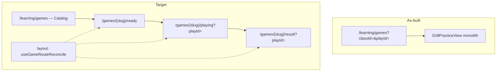
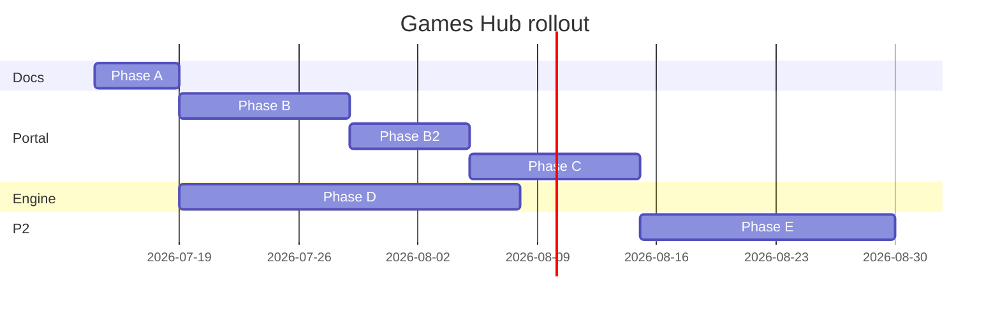

# Games Hub — Kế hoạch triển khai & đánh giá tác động

> **Cập nhật:** 2026-07-10 (E6 + assignment gap + P2 lobby cleanup)  
> **Trạng thái:** **Hoàn tất** Games Hub Phase A–E + P2 *(2026-07-10)*  
> **SSOT UX / taxonomy:** [GAMES_HUB_UX_ARCHITECTURE_SPEC.md](./GAMES_HUB_UX_ARCHITECTURE_SPEC.md)  
> **UI chuẩn Portal:** [STUDENT_PORTAL_LEARNING_UI.md](./STUDENT_PORTAL_LEARNING_UI.md)  
> **Engine:** [VOCABULARY_DRILL_ENGINE_SPEC.md](../../ebest-crm-api/docs/monorepo/vocabulary-learning-platform/VOCABULARY_DRILL_ENGINE_SPEC.md) · [GAME_ENGINE_ARCHITECTURE_SPEC.md](../../ebest-crm-api/docs/monorepo/learning-platform/GAME_ENGINE_ARCHITECTURE_SPEC.md)

---

## 0. Quyết định đã chốt (2026-07-10)

| ID | Quyết định | Ghi chú triển khai |
|----|------------|-------------------|
| **Q1** | **Tính điểm partial lên BXH** khi abandon | `finalizeDrillPlay` với `runOutcome.leaderboardContribution.eligible=true`; điểm = streak / correct đến thời điểm thoát |
| **Q2** | Redirect `/learning/games?classId=` → **`/meaning-to-word/ready?classId=`** | Shim + `vocabularyPracticeHref` migrate; catalog vẫn ở `/learning/games` không query |
| **Q3** | **Chặn start** khi còn `in_progress` cùng game — tiếp tục hoặc abandon trước | Ready screen + `GET plays/active` |
| **Q5** | **P0** — `GET plays/active?classId=&promptType=` | Banner/modal trên `/ready`; block duplicate start |

*Q4 (Speed run UI) — **đã ship** (picker + `GameSessionDurationPicker` 60/90/120s). Q6 (dashboard vs catalog) — chưa chốt; mặc định kỹ thuật: Q6=B catalog + header shortcuts.*

---

1. [Tóm tắt yêu cầu](#1-tóm-tắt-yêu-cầu)
2. [Hiện trạng (as-built)](#2-hiện-trạng-as-built)
3. [Mục tiêu & thay đổi](#3-mục-tiêu--thay-đổi)
4. [Đánh giá logic end-to-end](#4-đánh-giá-logic-end-to-end)
5. [Điểm mù & rủi ro](#5-điểm-mù--rủi-ro)
6. [Câu hỏi cần làm rõ](#6-câu-hỏi-cần-làm-rõ)
7. [Ma trận tác động](#7-ma-trận-tác-động)
8. [Chiến lược refactor code](#8-chiến-lược-refactor-code)
9. [Kế hoạch triển khai chi tiết](#9-kế-hoạch-triển-khai-chi-tiết)
10. [Kiểm thử & tiêu chí nghiệm thu](#10-kiểm-thử--tiêu-chí-nghiệm-thu)
11. [Tài liệu & chuẩn dự án](#11-tài-liệu--chuẩn-dự-án)

---

## 1. Tóm tắt yêu cầu

Tổng hợp từ các vòng phân tích UX Games Hub:

| # | Yêu cầu | Mức độ |
|---|---------|--------|
| R1 | **Taxonomy 3 tầng:** Game (`promptType`) → Mode (`modeId`) → Rules | Bắt buộc |
| R2 | **Catalog** `/learning/games` — gallery card theo game, không nhầm với mode | Bắt buộc |
| R3 | **URL state segments:** `/[gameSlug]/ready`, `/playing`, `/result` | Bắt buộc |
| R4 | **Reconcile reload/back:** `GET plays/:id` SSOT; sửa URL hoặc modal tiếp tục/kết thúc | Bắt buộc |
| R5 | **Exit guard:** confirm + **abandon API** trước khi rời khi `in_progress` | Bắt buộc |
| R6 | **Mode product:** Survival, Speed run, Best of… (alias `pool_coverage` → `best_of`) | P1 |
| R7 | **BXH trên hub:** top 10 + self rank theo game + mode | P1 |
| R8 | **Redirect tương thích** URL query cũ (`?classId=`, `?playId=`) | Bắt buộc |
| R9 | **Assignment / checklist deep link** vẫn hoạt động | Bắt buộc |
| R10 | Image games + distractor similarity | P2 |

---

## 2. Hiện trạng (as-built)

### 2.1 Route & navigation *(as-built 2026-07-10)*

| Route | Component | Ghi chú |
|-------|-----------|---------|
| `/learning/games` | `LearningGamesRouteEntry` → `GameCatalogView` | Legacy `?classId=` / `?playId=` redirect sync |
| `/learning/games/[gameSlug]/ready` | `GameReadyView` | Mode picker + BXH snapshot + active play banner |
| `/learning/games/[gameSlug]/playing` | `GamePlayingView` | `?playId=`; exit guard + abandon |
| `/learning/games/[gameSlug]/result` | `GameResultView` | `?playId=` |
| `/learning/games/leaderboard` | `LearningLeaderboardPageContent` | BXH đầy đủ |
| `/learning/games/assignments` | `GameAssignmentsListView` | Danh sách bài GV |
| `/learning/practice`, `/learning/drill` | redirect → slug/catalog | `legacy-games-redirect.utils` |

**State machine:** tách theo route phase — `GameSlugRouteShell` reconcile URL ↔ `GET plays/:id`.

**Đã xóa:** `DrillPracticeView.tsx`, `GamesDashboardView.tsx`.

### 2.2 Runtime stack (tái sử dụng được)

| Layer | File | Đánh giá |
|-------|------|----------|
| Generic session | `games/core/use-game-session.ts` | ✅ |
| Route shell | `GameSlugRouteShell` + `useGameSlug()` | ✅ Không render-prop RSC |
| Shared types | `game-drill-shared.types.ts` | ✅ `DrillPracticeSelection` SSOT |
| Session stub | `vocabulary-drill-session-config.utils.ts` | ✅ Lobby infer = assignment |

### 2.3 Gateway (ebest-social-gateway)

| Endpoint | Có |
|----------|-----|
| `POST .../plays` | ✅ |
| `GET .../plays/:id` | ✅ |
| `POST .../plays/:id/answer` | ✅ |
| `POST .../plays/:id/abandon` | ✅ |
| `GET .../plays/active` | ✅ |
| Leaderboard filter `promptType` / `modeId` | ✅ read filter + `best_of` alias normalize |

**Play status enum:** `in_progress` | `completed` — abandon finalize partial score (Q1); status `abandoned` GE backlog.

### 2.4 Entry points tạo URL (phải migrate)

| File | URL hiện tại | Cần đổi |
|------|--------------|---------|
| `vocabulary-session-routes.ts` | `/learning/games?classId=` | `buildGameReadyHref(slug, classId)` |
| `assignment-list-row-actions.ts` | `?classId=&assignmentId=` | `/meaning-to-word/ready?…` hoặc slug từ assignment |
| `StudentChecklistDetailBody.tsx` | `?classId=&checklistId=` | `/…/ready?checklistId=` |
| `GamesDashboardView.tsx` | `vocabularyPracticeHref` | Catalog hoặc default game ready |
| `DrillLeaderboardView.tsx` | link về `/learning/games` | Catalog |
| `dashboard-menu.tsx` | `/learning/games` | Giữ — trỏ catalog |
| `learning/practice/page.tsx` | redirect | Mở rộng redirect sang slug |

---

## 3. Mục tiêu & thay đổi

### 3.1 Thay đổi kiến trúc



### 3.2 Cải thiện so với hiện tại

| Hạng mục | Trước | Sau |
|----------|-------|-----|
| Bookmark / share | Khó — state React ẩn | URL segment + `playId` rõ |
| Reload | Resume nếu còn `playId` trên URL cũ | Reconcile + đúng segment |
| Back browser | Có thể rời play không kết thúc | Exit guard + abandon |
| Product taxonomy | «Nghe phát âm» như mode | Game riêng; mode Survival/Speed/Best of |
| BXH context | Trang riêng | Snapshot trên hub per game+mode |
| Code maintainability | 327+ dòng orchestration 1 file | View theo route, hook tái sử dụng |

### 3.3 Phạm vi **không** đổi trong phase đầu

- Flashcard (`/learning/flashcard`) — module riêng, có `complete` API riêng
- CRM authorize flow (`POST /api/student/learning/drill/authorize`)
- BFF proxy pattern (`learning-drill-gateway-proxy.ts`)
- WS namespace `/learning-drill-runtime`
- `useGameSession` answer/timer/WS core logic

---

## 4. Đánh giá logic end-to-end

### 4.1 Luồng happy path (free practice)

1. Catalog → chọn card `meaning-to-word` → `/ready?classId=12&modeId=survival`
2. `useDrillPracticePool` authorize với `promptType` từ slug + `modeId` từ query
3. «Bắt đầu» → `POST plays` → `replace` → `/playing?playId=x&classId=12`
4. `useGameRouteReconcile`: GET play → `in_progress` + slug khớp → `useGameSession` resume/start UI
5. Answer loop → engine complete → `replace` → `/result?playId=x`
6. «Chơi lại» → `/ready?classId=12&modeId=survival`

**Đánh giá:** Logic khả thi; bước 3–4 cần đảm bảo **chỉ một** nơi gọi resume (reconcile hoặc `useGameSession`, không double-fetch).

### 4.2 Luồng assignment

1. Deep link `/meaning-to-word/ready?classId=&assignmentId=`
2. Hub ẩn mode picker; hiện `AssignmentLobbyHero` logic
3. Start → playing → result; gradebook sync như hiện tại

**Đánh giá:** `useDrillPracticePool` đã hỗ trợ `assignmentId` — chỉ cần truyền từ route query; **cần chốt slug** khi assignment không chỉ định `promptType` (xem §6).

### 4.3 Luồng checklist penalty

- URL: `/…/ready?classId=&checklistId=`
- Mode thường `pool_coverage` — map UI «Best of…»

**Đánh giá:** `checklistId` đã có trong authorize context; back link hiện về `/classes` — giữ.

### 4.4 Reconcile matrix (tóm tắt)

Chi tiết: [GAMES_HUB_UX_ARCHITECTURE_SPEC.md §3.4](./GAMES_HUB_UX_ARCHITECTURE_SPEC.md#34-url-reconcile--reload--browser-back).

| Case | Quyết định logic | Rủi ro nếu sai |
|------|------------------|----------------|
| `/playing` + API `completed` | Auto → `/result` | Flash result trên playing |
| `/result` + API `in_progress` | Modal tiếp tục / abandon | User tưởng đã xong |
| Sai `gameSlug` | Redirect đúng slug | Chơi nhầm game UI |
| `/playing` thiếu `playId` | → `/ready` | 404 logic |
| GET play 404 | Toast + `/ready` | Kẹt loading |

### 4.5 Abandon semantics

| Mode | Điểm ghi nhận | LB eligible? | Assignment |
|------|---------------|--------------|------------|
| Survival | `scoreInRun` (streak) | Theo `runOutcome` — đề xuất `eligible: false` | Không đạt nếu chưa threshold |
| `pool_coverage` | `correctCount` / partial pool | `total_correct` partial? | Có thể chưa đạt minimum |
| Speed run *(chưa có)* | correct đến thời điểm | TBD | TBD |

**Đánh giá:** ✅ Q1 — abandon gọi `finalizeDrillPlay` với score hiện tại và `leaderboardContribution.eligible: true`.

### 4.6 Double resume — điểm kỹ thuật quan trọng

**Hiện tại:** `useGameSession` effect tự gọi `resumeGameSession` khi có `playIdFromUrl`.

**Sau refactor:** reconcile layout fetch play **trước** → pass snapshot xuống playing view.

**Quy tắc:** Chọn **một** SSOT fetch:

- **Option A (khuyến nghị):** Reconcile fetch → context `reconciledPlay` → `useGameSession` skip auto-resume nếu đã có initial state.
- **Option B:** Reconcile chỉ validate URL; `useGameSession` vẫn fetch — đơn giản hơn nhưng 2 GET mỗi mount.

---

## 5. Điểm mù & rủi ro

### 5.1 Logic / product

| ID | Điểm mù | Mức | Giảm thiểu |
|----|---------|-----|------------|
| B1 | **Hai play `in_progress`** cùng user — start mới khi còn lượt cũ | Cao | Chặn start trên ready nếu có active play; hoặc auto-abandon lượt cũ (cần product) |
| B2 | ~~Abandon vs completed — BXH~~ | — | ✅ Q1: partial score **eligible** |
| B3 | **Assignment slug** khi GV không chọn promptType | Trung bình | Default `meaning-to-word` hoặc derive từ `sessionConfig` |
| B4 | **Speed run** chưa có engine — hub hiện 3 mode nhưng 1 mode disabled | Trung bình | Phase C: chỉ show mode đã ship; feature flag |
| B5 | **BXH hub** không filter promptType — snapshot sai game | Trung bình | Phase C stub class LB; E5 backend sau |
| B6 | **Checklist + catalog** — user vào catalog chưa chọn lớp | Thấp | Giữ `LearningDashboardClassContextCard` |
| B7 | **`popstate` intercept** trên Next.js App Router — không có API router blocker chính thức | Cao | `beforePopState` pattern: `history.pushState` trap + modal; hoặc `@see` quiz attempt pattern |
| B8 | **Concurrent tab** — 2 tab cùng `playId` | Trung bình | WS `STATE_SYNC` đã có; UI stale nếu abandon tab kia |
| B9 | **Redirect default game** `?classId=` → `meaning-to-word` có thể sai ý user | Thấp | Redirect catalog nếu chưa chọn game (§6 Q2) |
| B10 | **`playId` only** resume — thiếu `classId` trên URL | Trung bình | Reconcile bổ sung query từ API response `classId` |

### 5.2 Kỹ thuật

| ID | Điểm mù | Mức | Giảm thiểu |
|----|---------|-----|------------|
| T1 | BFF catch-all **404** mọi path ngoài plays/answer | Cao | Thêm `abandon` vào allowlist proxy |
| T2 | Enum Mongo chỉ 2 status — migration `abandoned` | Trung bình | Dùng `completed` + `runOutcome.reason=user_exit` phase 1 |
| T3 | `LearningGamesPageContent` xóa sớm — break redirect | Cao | Giữ shim redirect đến hết Phase B |
| T4 | Unit test `DrillPracticeView` gắn URL cũ | Trung bình | Cập nhật test theo route helpers |
| T5 | `promptType` trong play vs slug — audio game disabled khi pool thiếu audio | Trung bình | `eligibilityCheck` trên catalog card |
| T6 | GE smoke tests hardcode URL cũ | Trung bình | Cập nhật `test:ge-pilot-smoke` |

### 5.3 Tham chiếu pattern có sẵn trong monorepo

| Pattern | Nơi tham khảo | Áp dụng |
|---------|---------------|---------|
| Exit / forfeit confirm | `QuizAttemptClient.tsx` + `useQuizAttemptRuntime` | `forfeitListeningSection`, `ignoreUrlNav` |
| Phase URL (quiz) | `quiz-test` runtime | Segment state tương tự |
| Container/Presentational | `STUDENT_PORTAL_LEARNING_UI.md` §1 | Tách GameReadyView / Playing / Result |
| BFF proxy | `learning-drill-gateway-proxy.ts` | Thêm abandon route |
| Game core hook | `use-game-session.ts` | Extend, không fork |

---

## 6. Câu hỏi cần làm rõ

Các quyết định **block** hoặc **ảnh hưởng schema**:

### Q1 — Abandon ghi BXH thế nào? ✅ **Đã chốt: B — tính điểm partial**

- Điểm ghi nhận: survival = `scoreInRun` (streak); pool = `correctCount` / partial accuracy.
- Rollup LB: `eligible: true` với score tại thời điểm abandon.
- Cần align `GAME_ENGINE_LEADERBOARD_AND_ANALYTICS.md` — abandon không coi là «không chơi».

### Q2 — Redirect `/learning/games?classId=12`? ✅ **Đã chốt: B — default game**

- `?classId=` → `/learning/games/meaning-to-word/ready?classId=`
- `?classId=&playId=` → resolve slug từ `GET play` → `/playing` hoặc `/result`
- `?classId=&assignmentId=` → slug từ `sessionConfig.promptType` hoặc default `meaning-to-word`

### Q3 — Start mới khi còn `in_progress`? ✅ **Đã chốt: A — chặn**

- Modal: «Tiếp tục lượt» / «Kết thúc lượt» / hủy.
- Không gọi `POST plays` cho đến khi không còn active play cùng `(customerId, classId, promptType)`.

### Q4 — Hub mode Speed run chưa có engine? ✅ **Đã ship (D1)**

- Picker 60/90/120s + engine `speed_run` + Gateway timer.

### Q5 — Active play discovery? ✅ **Đã chốt: A — P0 API**

```
GET .../plays/active?customerId=&classId=&promptType=
→ { playId, status, modeId, scoreInRun, startedAt } | null
```

- Index Mongo sẵn: `{ customerId, status, startedAt }` — thêm filter `classId`, `promptType`.
- Portal: banner trên `/ready`; reconcile khi không có `playId` trong URL.

### Q6 — `GamesDashboardView` sau migration? ✅ **Đã chốt: B**

- Catalog + header shortcuts (BXH, Bài tập, chọn lớp).

---

### 7.1 Student Portal — file theo phase

| File / module | Phase | Hành động |
|---------------|-------|-----------|
| `app/.../games/page.tsx` | B | Render `GameCatalogView` |
| `app/.../games/[gameSlug]/**` | B | **Mới** — layout + 3 pages |
| `games/catalog/game-catalog.registry.ts` | B | **Mới** |
| `games/session/use-game-route-reconcile.ts` | B2 | **Mới** |
| `games/session/use-game-exit-guard.ts` | B2 | **Mới** |
| `vocabulary-session-routes.ts` | B | **Sửa** — href builders |
| `learning/games/page.tsx` shim | B | Redirect query cũ |
| `LearningGamesPageContent.tsx` | B→C | Deprecate → redirect only |
| `DrillPracticeView.tsx` | C | Split → `GamePlayingView` |
| `FreePracticeLobbyHero.tsx` | C | Deprecate prompt picker |
| `GameModePicker.tsx` | C | **Mới** |
| `use-game-session.ts` | B2 | `abandonSession()` |
| `learning-api.ts` | B2 | `abandonDrillSession()` |
| `learning-drill-gateway-proxy.ts` | B2 | Allow abandon path |
| `assignment-list-row-actions.ts` | B | New href shape |
| `StudentChecklistDetailBody.tsx` | B | New href shape |
| `dashboard-menu.tsx` | B | Không đổi path |
| `GAMES_HUB_UX_ARCHITECTURE_SPEC.md` | A | SSOT UX |
| `STUDENT_PORTAL_LEARNING_UI.md` | A | §4 route table |

### 7.2 Social Gateway

| File | Phase | Hành động |
|------|-------|-----------|
| `drill-student-internal.controller.ts` | B2 | `POST plays/:id/abandon` |
| `drill-play.service.ts` | B2 | `abandonPlay()` → finalize partial |
| `vocabulary-drill.enums.ts` | B2 | Optional `ABANDONED` hoặc reason flag |
| `drill-play-ws-publish.util.ts` | B2 | `PLAY_CLOSED` on abandon |
| `drill-rollup.service.ts` | B2 | Policy eligible false |
| Leaderboard read service | E | Filter `modeId`, `promptType` |

### 7.3 CRM API

| Hạng mục | Phase | Ghi chú |
|----------|-------|---------|
| Authorize assembler | C | `best_of` alias |
| `presentLeaderboardV2` | E | Filter game+mode |
| Activity log | E | `game.abandoned` event *(optional)* |

### 7.4 Game packages (`ebest-game`)

| Hạng mục | Phase |
|----------|-------|
| `speed_run` catalog | D |
| `best_of` alias | D |
| Distractor selector | E |

---

## 8. Chiến lược refactor code

### 8.1 Nguyên tắc (theo `STUDENT_PORTAL_LEARNING_UI.md` + `REACT_CRM_STANDARDS`)

1. **Container theo route** — mỗi page là container; presentational giữ trong `games/vocabulary-drill/presentation/`.
2. **Không breaking parallel** — shim redirect URL cũ cho đến khi xóa `LearningGamesPageContent`.
3. **Hook generic không fork** — mở rộng `useGameSession`, không copy.
4. **Route helpers SSOT** — `game-route.utils.ts` + `vocabulary-session-routes.ts` wrap.
5. **i18n** — copy modal vi-VN trước; keys trong locale files.

### 8.2 Tách `DrillPracticeView` — mapping

| Khối hiện tại | Đích |
|---------------|------|
| Pool + authorize (`useDrillPracticePool`) | `GameReadyView` + `GamePlayingView` shared hook / context |
| Lobby (`DrillPracticeLobby`) | `GameReadyView` |
| Splash start/resume | `GamePlayingView` |
| `DrillGameLayout` | `GamePlayingView` |
| `VocabularyDrillRunResultScreen` | `GameResultView` |
| `setPlayIdInUrl` | `buildGamePlayingHref` + `router.replace` |
| `backHref` logic | `buildGameReadyHref` / catalog |

### 8.3 Layout `[gameSlug]`

```tsx
// Pseudocode — không implement ở đây
export default function GameSlugLayout({ children, params }) {
  const segment = useUrlSegment(); // ready | playing | result
  const reconcile = useGameRouteReconcile({ gameSlug: params.gameSlug, segment });
  if (reconcile.status === 'loading') return <GameRouteSkeleton />;
  if (reconcile.status === 'redirect') { reconcile.redirect(); return null; }
  if (reconcile.status === 'confirm') return <GameMismatchModal ... />;
  return (
    <GameSessionRouteContext.Provider value={reconcile}>
      {children}
    </GameSessionRouteContext.Provider>
  );
}
```

### 8.4 Thứ tự refactor an toàn

1. Thêm route mới + registry + helpers (**không** xóa cũ)
2. Redirect `/learning/games?…` → slug routes
3. Ship B2 backend abandon
4. Chuyển playing flow sang route mới
5. Chuyển ready (hub) + catalog
6. Xóa `LearningGamesPageContent` branch `DrillPracticeView`
7. Xóa `FreePracticeLobbyHero` prompt-as-mode

---

## 9. Kế hoạch triển khai chi tiết

### Phase A — Chốt spec & ADR (3–5 ngày)

| Task | Owner | Deliverable | Phụ thuộc |
|------|-------|-------------|------------|
| A1 | PO + dev | Trả lời §6 Q1–Q6 | — |
| A2 | Dev | ADR abandon semantics | A1 |
| A3 | Dev | Cập nhật `VOCABULARY_DRILL_ENGINE_SPEC` §8 | A1 |
| A4 | Dev | `game-catalog.registry.ts` skeleton (2 game ship) | — |

**Exit criteria:** Không còn câu hỏi block P0; registry có `meaning_to_word`, `audio_to_word`.

---

### Phase B — Route tree + catalog + redirect (1 sprint)

| Task | File | Chi tiết |
|------|------|----------|
| B1 | `app/.../games/[gameSlug]/layout.tsx` | Validate slug từ registry; `notFound()` nếu invalid | ✅ |
| B2 | `ready/playing/result/page.tsx` | Shell + Suspense |
| B3 | `GameCatalogView` | Grid card; class context header |
| B4 | `game-route.utils.ts` | `slugToPromptType`, `buildGameReadyHref`, … |
| B5 | `vocabulary-session-routes.ts` | Delegate sang game-route utils |
| B6 | `learning/games/page.tsx` | Catalog thay `GamesDashboardView` *(hoặc Q6)* |
| B7 | `learning/practice/page.tsx` | Redirect nâng cấp → slug | ✅ |
| B8 | Shim `LearningGamesPageContent` | `?classId=` → redirect ready |
| B9 | i18n | Catalog + route labels |
| B10 | Unit tests | `game-route-reconcile.utils` pure functions |

**Exit criteria:**

- [x] `/learning/games` hiện catalog (2 game)
- [x] `/learning/games?classId=1` redirect đúng (theo Q2)
- [x] Deep link assignment/checklist redirect sang `/ready`
- [ ] Không regression flashcard / vocabulary hub — *smoke thủ công*

**Phase B–D1: chức năng core + speed_run hoàn tất** *(2026-07-10)* — còn Phase E (image, TTL) + smoke E2E browser.

---

### Phase B2 — Reconcile + abandon + exit guard (0.5–1 sprint, **gate playing**) ✅ *đã triển khai*

| Task | Service | Chi tiết |
|------|---------|----------|
| B2-1 | Gateway | `abandonPlay()` — finalize partial, **LB eligible**, WS close |
| B2-2 | Gateway | `GET plays/active` + `POST .../abandon` |
| B2-3 | Portal BFF | Proxy abandon |
| B2-4 | Portal | `abandonDrillSession()` |
| B2-5 | Portal | `useGameRouteReconcile` + matrix |
| B2-6 | Portal | `useGameExitGuard` — beforeunload + popstate |
| B2-7 | Portal | `useGameSession.abandonSession()` |
| B2-8 | Portal | `GamePlayingView` — migrate từ `DrillPracticeView` playing slice |
| B2-9 | Portal | HUD «Thoát» |
| B2-10 | Test | Integration: start → playing URL → reload resume |
| B2-11 | Test | playing → navigate away → confirm → abandon |

**Exit criteria:**

- [x] F5 trên `/playing` resume đúng câu *(prefetch reconcile → session)*
- [x] `/result` + API `in_progress` → modal hoạt động
- [x] Rời playing có confirm; abandon gọi server
- [ ] `PLAY_CLOSED` WS sau abandon *(smoke thủ công)*

---

### Phase C — Game Ready hub (1 sprint) ✅ *đã triển khai (trừ E2E)*

| Task | Chi tiết |
|------|----------|
| C1 | `GameModePicker` — Survival + Best of + **Speed run** | ✅ |
| C2 | `GameHubLeaderboardPanel` — top 5; filter `promptType` |
| C3 | `GameReadyView` — gộp `DrillPracticeLobby` logic |
| C4 | `GameResultView` — tách result; CTA routes |
| C5 | Wire authorize `promptType` từ slug |
| C6 | Banner tiếp tục lượt *(Q5 + GET plays/active)* |
| C7 | Xóa `LearningGamesPageContent` drill branch | ✅ |
| C8 | Deprecate `FreePracticeLobbyHero` mode/prompt mix | ✅ Gỡ legacy picker — hero + CTA only |
| C9 | Xóa `DrillPracticeView` / `GamesDashboardView` monolith | ✅ |

**Exit criteria:**

- [x] Ma trận T1–T11 vitest (`games-hub-acceptance.matrix.test.ts`)
- [x] Playwright scaffold — `e2e/games-hub/` (T6, T11 public; T1, T7–T8 authenticated)
- [ ] Full flow catalog → ready → playing → result *(browser + Gateway live)*
- [ ] Assignment + checklist flows E2E *(authorize wire — cần credentials)*
- [x] BXH snapshot hiển thị theo `promptType`

---

### Phase D — Engine modes (song song / sau C) ✅ *D1–D4 code complete*

| Task | Chi tiết | Trạng thái |
|------|----------|------------|
| D1 | `speed_run` trong `@ebest/game-vocabulary-drill` + Gateway timer + Portal UI | ✅ |
| D2 | Alias `best_of` ↔ `pool_coverage` | ✅ `game-mode.utils` + URL + LB normalize |
| D3 | UI copy «Best of…», «Speed run» + duration picker 60/90/120s | ✅ |
| D4 | Smoke `test:ge-pilot-smoke` | ✅ GH-ACTIVE + GH-ABANDON + GH-SPEED-* *(cần chạy trên env)* |

**Gap D:** ✅ Đã đóng — assignment hỗ trợ `speed_run` + 4 `promptType` (CRM form + API normalize).

---

## Chuẩn hóa engine (2026-07-10)

| SSOT | Package | Dùng bởi |
|------|---------|----------|
| `GameSessionConfig`, mode types | `@ebest/game-engine-core` | CRM, Gateway, Portal |
| Mode catalog + assemble | `@ebest/game-vocabulary-drill` | CRM `assembleVocabularyDrillSessionConfig`, Portal stub |
| Mode helpers (`isPoolCoverageMode`, …) | `@ebest/game-engine-core` | Portal `useDrillPracticeSession`, Gateway |
| Presentation fields | `@ebest/game-vocabulary-drill` `resolveVocabularyDrillModePresentationFields` | Portal mapper adapter |

**Quy tắc game mới:** thêm mode vào `VOCABULARY_DRILL_MODE_CATALOG` (hoặc family catalog tương ứng) — **không** if/else mode rải rác UI/Gateway.

---

### Phase E — Mở rộng ✅ *hoàn tất 2026-07-10*

| Task | Trạng thái | Ghi chú |
|------|------------|---------|
| E3 `image_to_word` / `word_to_image` | ✅ | Engine + CRM eligibility + Gateway snapshot + Portal widgets + catalog 4 game |
| E3b Catalog eligibility (audio/image counts) | ✅ | CRM `audioEntryCount`/`imageEntryCount` trên pool summary; `GameCatalogView` disable + tooltip |
| E4 Distractor similarity | ✅ | `pick-mcq-distractors.util.ts` — tier/POS/độ dài từ |
| E5 Leaderboard hub top 10 | ✅ | `GameHubLeaderboardPanel` `pageSize: 10` |
| E5b BXH trang đầy đủ filter game+mode | ✅ | `DrillLeaderboardView` + query `promptType`/`modeId` |
| E6 `classSessionId` Best of buổi | ✅ | CRM authorize + `GameBestOfPoolScopePicker` + deep link buổi |
| E10 Orphan TTL | ✅ | lazy abandon + cleanup-stale |
| E11 Exit guard navigation nội bộ | ✅ | `GameExitGuardProvider` + link capture |
| E12 Playwright T1–T5, T9–T10 | ✅ | `playing-mock.spec.ts` — mock BFF + session stub |
| E13 Reconcile modal «Bỏ qua» + toast 404 | ✅ | `GameSlugRouteShell` |
| E14 `GameResultView` CTA «Game khác» | ✅ | Link catalog |

**Gap assignment:** ✅ CRM form + normalize hỗ trợ 4 `promptType` + `speed_run`; API SSOT `@ebest/game-vocabulary-drill` từ trước.

---

## 12. Đánh giá tổng quan (2026-07-10)

### 12.1 Full-flow logic — hợp lý ✅ / cần theo dõi ⚠️

| Luồng | Đánh giá | Ghi chú |
|-------|----------|---------|
| Catalog → ready → playing → result | ✅ | Route tree + authorize từ slug |
| Reload `/playing` | ✅ | Reconcile prefetch → `useGameSession` |
| Abandon partial → BXH | ✅ | Q1 — Gateway finalize |
| Active play chặn start | ✅ | Banner + `canStart` |
| Audio/image eligibility | ✅ | Authorize CRM + catalog card (sau E3b) |
| Exit qua menu/sidebar | ✅ | E11 — `GameExitGuardProvider` |
| Assignment/checklist E2E | ✅ | Mock: ready + start + lobby prefetch |
| Image game trên lớp thiếu ảnh | ✅ | Card disabled + message rõ |

### 12.2 UI vs yêu cầu mới

| Yêu cầu UX spec | Khớp? | Gap |
|-----------------|-------|-----|
| Taxonomy 3 tầng (game/mode/rules) | ✅ | |
| 4 game trên catalog | ✅ | |
| Mode picker trên `/ready` | ✅ | Image games dùng chung 3 mode |
| Widget `image_mcq` / `word_image_mcq` | ✅ | CSS ảnh stem + option |
| Catalog eligibility tooltip | ✅ | E3b |
| BXH hub top 10 theo game+mode | ✅ | Trang BXH đầy đủ filter game+mode (E5b) |
| Result CTA chơi lại / game khác | ✅ | E14 |
| Best of pool source UI | ✅ | E6 — Cả lớp / Buổi học |
| Card hover SFX | ✅ | `playGameCardHoverSound` + click `playGameCardClickSound` |

### 12.3 Hoàn tất P2 ✅ *(2026-07-10)*

| Hạng mục | Trạng thái |
|----------|------------|
| Card hover/click SFX | ✅ |
| CRM preset Speed run | ✅ |
| Runtime layer vocabulary drill | ✅ |
| Runtime layer flashcard review | ✅ |
| Checklist prefetch authorize | ✅ |
| E2E T1 assignment start (mock) | ✅ |
| E2E T8 checklist lobby (mock) | ✅ |

*E2E credentials staging (Gateway thật): optional — chạy `games-hub-authenticated` khi có `E2E_PORTAL_LOGIN_ID`.*

### 12.5 Refactor runtime layer ✅ *(2026-07-10)*

| Module | Vai trò |
|--------|---------|
| `games/vocabulary-drill/runtime/vocabulary-drill-answer.service.ts` | Logic UI answer theo `sessionPolicyId` catalog |
| `games/vocabulary-drill/runtime/vocabulary-drill-pool.service.ts` | Selection / canStart / block reason |
| `games/vocabulary-drill/runtime/vocabulary-drill-runtime.adapter.ts` | HTTP + WS I/O tách khỏi hook |
| `games/flashcard-review/runtime/` | Flashcard adapter + session service |
| `games/registry/game-runtime.registry.ts` | `vocabulary_drill` + `flashcard_review` |
| `games/session/use-game-route-reconcile.ts` | Reconcile URL ↔ play (tách shell) |
| `games/session/game-route.context.tsx` | Route context tách shell |

### 12.4 Test matrix (cập nhật)

| Suite | Kết quả |
|-------|---------|
| Portal vitest | **75/75** |
| `@ebest/game-vocabulary-drill` | **25/25** |
| Gateway `test:learning-drill` | **45/45** |
| Playwright games-hub public | **13/13** mock |

---

### Timeline gợi ý



---

## 10. Kiểm thử & tiêu chí nghiệm thu

### 10.1 Unit

| Target | Case |
|--------|------|
| `game-route-reconcile.utils` | Mọi ô ma trận §3.4 |
| `game-catalog.registry` | Slug ↔ promptType bijection |
| `buildGameRoute` | Query preservation |

### 10.2 Integration (Portal)

| # | Scenario |
|---|----------|
| T1 | Catalog → ready → start → playing URL |
| T2 | Reload playing — resume question |
| T3 | Complete → result URL; back → forward result |
| T4 | Result URL + in_progress API — continue |
| T5 | Result URL + in_progress — abandon |
| T6 | Wrong slug — redirect |
| T7 | Assignment deep link |
| T8 | Checklist deep link |
| T9 | Exit guard — cancel stays |
| T10 | Exit guard — confirm abandon |
| T11 | Legacy `?classId=&playId=` redirect |

### 10.3 Gateway

| # | Scenario |
|---|----------|
| G1 | Abandon survival — score preserved |
| G2 | Abandon pool_coverage — partial progress |
| G3 | Abandon idempotent (đã completed) |
| G4 | WS PLAY_CLOSED payload |

### 10.4 Regression

- Flashcard session không đổi
- Leaderboard trang tổng
- `test:ge-pilot-smoke` pass sau update URL

---

## 11. Tài liệu & chuẩn dự án

| Chuẩn | Áp dụng |
|-------|---------|
| [STUDENT_PORTAL_LEARNING_UI.md](./STUDENT_PORTAL_LEARNING_UI.md) | Container/presentational, route table §4 |
| [NEXTJS_PORTAL_STANDARDS.md](../../ebest-crm-api/docs/monorepo/standards/NEXTJS_PORTAL_STANDARDS.md) | App Router, BFF, `cache: 'no-store'` |
| [REACT_CRM_STANDARDS.md](../../ebest-crm-api/docs/monorepo/standards/REACT_CRM_STANDARDS.md) | Hook naming, i18n |
| [GAME_ENGINE_END_TO_END_SPEC.md](../../ebest-crm-api/docs/monorepo/learning-platform/GAME_ENGINE_END_TO_END_SPEC.md) | Play lifecycle, abandoned backlog |
| [GAME_ENGINE_LEADERBOARD_AND_ANALYTICS.md](../../ebest-crm-api/docs/monorepo/learning-platform/GAME_ENGINE_LEADERBOARD_AND_ANALYTICS.md) | LB eligible on abandon |

**Cập nhật khi merge từng phase:** checklist §9 của `GAMES_HUB_UX_ARCHITECTURE_SPEC.md`.

---

*Kế hoạch này là SSOT triển khai Games Hub; thay đổi thứ tự phase cần sync với UX spec và PO.*
