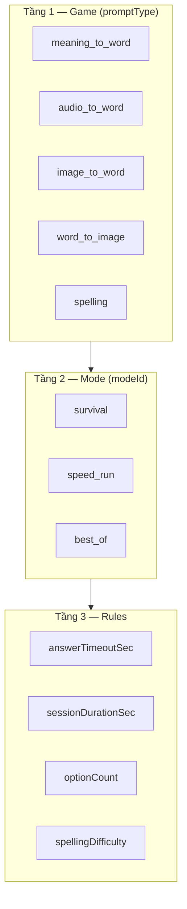
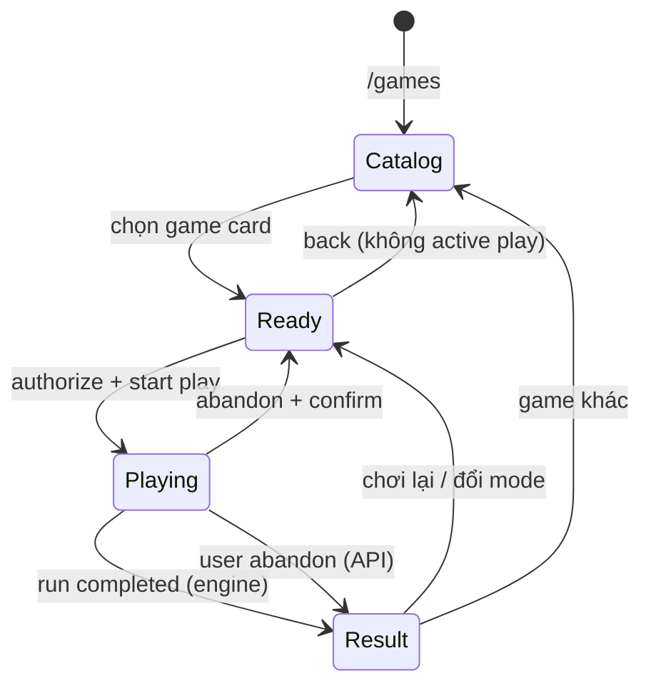
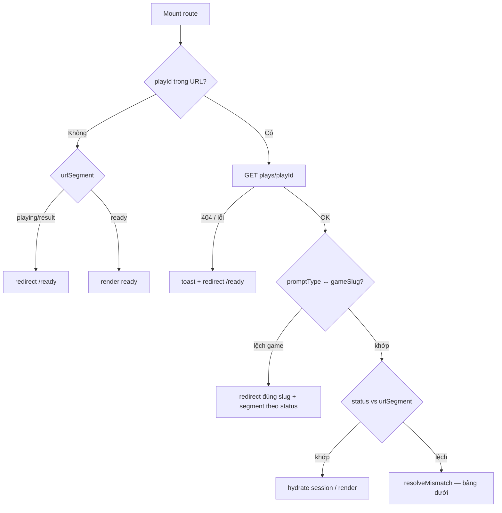
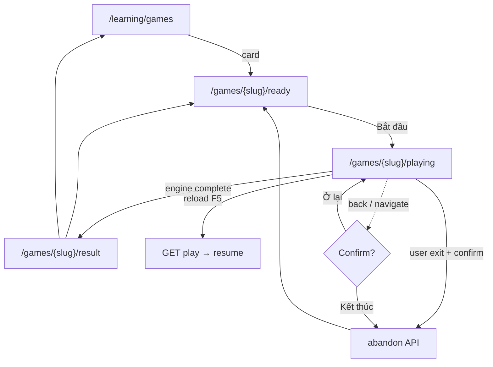

# Games Hub — Kiến trúc UX & taxonomy (Student Portal)

> **Cập nhật:** 2026-07-10 (v5 — as-built Phase B–C)  
> **Trạng thái:** Đã triển khai core — Phase D/E còn mở  
> **Kế hoạch chi tiết:** [GAMES_HUB_IMPLEMENTATION_PLAN.md](./GAMES_HUB_IMPLEMENTATION_PLAN.md)  
> **Phạm vi:** `/learning/games` và cây route con  
> **Liên quan:** [STUDENT_PORTAL_LEARNING_UI.md](./STUDENT_PORTAL_LEARNING_UI.md) · [GAME_ENGINE_ARCHITECTURE_SPEC.md](../../ebest-crm-api/docs/monorepo/learning-platform/GAME_ENGINE_ARCHITECTURE_SPEC.md) · [VOCABULARY_DRILL_ENGINE_SPEC.md](../../ebest-crm-api/docs/monorepo/vocabulary-learning-platform/VOCABULARY_DRILL_ENGINE_SPEC.md) · [SPELLING_GAME_SPEC.md](../../ebest-crm-api/docs/monorepo/vocabulary-learning-platform/SPELLING_GAME_SPEC.md) (planned)

---

## 1. Vấn đề hiện tại

| Vấn đề | Mô tả |
|--------|--------|
| **URL phẳng** | `/learning/games` vừa là dashboard chức năng, vừa là lobby/play khi có `?classId=` — không có URL riêng cho từng game |
| **Nhầm mode / prompt** | Lobby hiển thị «Survival» và «Nghe phát âm» cùng cấp — thực tế cùng `modeId: survival`, khác `promptType` |
| **Dashboard ≠ catalog** | `GamesDashboardView` là menu «Chơi / BXH / Bài tập» — không phải gallery các **dạng game** (promptType) |
| **BXH tách rời** | Leaderboard ở route khác; lobby game không embed thứ hạng cá nhân theo mode + prompt |
| **Tên mode chưa thống nhất** | Code: `pool_coverage`; product: **Best of…**; chưa có **Speed run** |
| **State ẩn trong query** | `playId` + lobby/play cùng URL — không có segment `ready` / `playing` / `result` |
| **Thoát giữa chừng** | Không confirm; play `in_progress` có thể «mồ côi» trên server — chưa có API abandon |
| **Reload / Back lệch state** | URL segment và `GET plays/:id` không được reconcile — resume chỉ chạy trong `useGameSession` khi đúng route cũ |

---

## 2. Taxonomy chuẩn (product ↔ engine)

### 2.1 Ba tầng tách bạch



| Tầng | Product label (VI) | `modeId` / `promptType` code | Mô tả ngắn |
|------|-------------------|------------------------------|------------|
| **Game** | Nghĩa → chọn từ | `promptType: meaning_to_word` | Stem nghĩa VI, 4 từ EN |
| **Game** | Nghe → chọn từ | `promptType: audio_to_word` | Stem audio, 4 từ EN |
| **Game** | Hình → chọn từ | `promptType: image_to_word` | Stem ảnh, 4 từ EN |
| **Game** | Từ → chọn hình | `promptType: word_to_image` | Stem từ, 4 ảnh |
| **Mode** | **Survival** | `modeId: survival` | Sai 1 câu (hoặc hết giờ/câu) = hết lượt; điểm = streak |
| **Mode** | **Speed run** | `modeId: speed_run` | Hết **thời gian phiên** = kết thúc; điểm = số câu đúng trong cửa sổ |
| **Mode** | **Best of…** | `modeId: best_of` *(alias `pool_coverage`)* | Chơi hết pool buổi / pool GV chọn; điểm = accuracy |

**Quy ước đặt tên:**

- UI **không** dùng «Timeout» — dùng **Speed run**.
- UI **không** dùng «Pool coverage» — dùng **Best of…** (kèm subtitle: «Toàn bộ từ buổi» / «Bộ từ đã chọn»).
- «Nghe phát âm» là **tên game**, không phải mode.

### 2.2 Alias migration (engine)

| Code hiện tại | Code mục tiêu | Ghi chú |
|---------------|---------------|---------|
| `pool_coverage` | `best_of` | Giữ backward-compat alias 1 release |
| — | `speed_run` | Mode mới: `sessionPolicyId: end_on_timer`, `scoring: correct_count_in_window` |
| `survival` | `survival` | Giữ nguyên |

### 2.3 Ma trận game × mode (free practice)

| | Survival | Speed run | Best of… |
|---|:---:|:---:|:---:|
| Nghĩa → từ | ✅ | ✅ | ✅ *(pool buổi)* |
| Nghe → từ | ✅ | ✅ | ✅ |
| Hình → từ | ✅ | ✅ | ✅ |
| Từ → hình | ✅ | ✅ | ✅ |

**Assignment GV:** thường **Best of…** + `vocabulary_selection`; có thể mở thêm Survival / Speed run theo cấu hình sau.

---

## 3. Cây URL & game state (route tree)

### 3.1 Nguyên tắc: **state nằm trên path**, config trên query

Mỗi game (`gameSlug`) có **các segment state** cố định — dễ bookmark, guard navigation, analytics.

```
/learning/games
├── (index)                                    → Catalog (danh sách game / promptType)
├── /leaderboard                               → BXH tổng
├── /assignments                               → Bài tập GV
└── /[gameSlug]
    ├── (index) → redirect                     → /[gameSlug]/ready?…
    ├── /ready                                   → Lobby: chọn mode, config, BXH, «Bắt đầu»
    ├── /playing?playId=                         → Đang chơi (bắt buộc playId khi active)
    └── /result?playId=                          → Kết quả lượt vừa xong
```

**Ví dụ cụ thể:**

| URL | UI state |
|-----|----------|
| `/learning/games` | Catalog card |
| `/learning/games/meaning-to-word/ready?classId=12&modeId=survival` | Hub — đã chọn Survival |
| `/learning/games/meaning-to-word/playing?playId=abc&classId=12` | In-game MCQ |
| `/learning/games/meaning-to-word/result?playId=abc` | Màn hình điểm / streak |

**`gameSlug` ↔ `promptType`:**

| Slug URL | `promptType` |
|----------|----------------|
| `meaning-to-word` | `meaning_to_word` |
| `audio-to-word` | `audio_to_word` |
| `image-to-word` | `image_to_word` |
| `word-to-image` | `word_to_image` |
| `spelling` | `spelling` *(title UI: **Spelling** — planned SP-0)* |

**Query params theo state:**

| Param | `ready` | `playing` | `result` |
|-------|:---:|:---:|:---:|
| `classId` | ✅ | ✅ | optional |
| `modeId` | ✅ | *(snapshot trên play)* | optional |
| `difficulty` | ✅ *(spelling only: easy/medium/hard)* | — | — |
| `assignmentId` / `checklistId` | khi có | khi có | optional |
| `playId` | — | **bắt buộc** | **bắt buộc** |
| `classSessionId` | Best of buổi | — | — |

**Redirect tương thích:**

- `/learning/games?classId=1` → `/learning/games/meaning-to-word/ready?classId=1` *(default game — Q2)*
- `/learning/games?classId=1&playId=x` → `/learning/games/meaning-to-word/playing?playId=x&classId=1`
- `/learning/practice?…` → giữ redirect cũ

### 3.2 State machine (client + server)



| State | Path segment | `play.status` (Mongo) | Guard thoát |
|-------|--------------|----------------------|-------------|
| **ready** | `/ready` | — / không có play | Tự do |
| **playing** | `/playing` | `in_progress` | **Bắt buộc confirm + abandon** |
| **result** | `/result` | `completed` \| `abandoned` | Tự do |

**Quy tắc đồng bộ URL ↔ session:**

1. Sau `startSession()` → `router.replace` sang `/playing?playId=…` (không `push` — tránh back vào pre-start).
2. Khi `finished` → `router.replace` sang `/result?playId=…`.
3. **Mọi mount** route `[gameSlug]/*` có `playId` → chạy **reconcile** (§3.4): `GET plays/:playId` là SSOT.
4. Truy cập `/ready` không có `playId` nhưng API báo user còn `in_progress` play *(tuỳ chọn P2: list active)* → banner «Tiếp tục lượt» / «Kết thúc».

### 3.3 Exit guard — thoát chủ động (không phải reload)

**Phạm vi kích hoạt:** `gamePhase === 'playing'` **và** client đã reconcile xong **và** API `status === in_progress`.

| Hành động user | Hành vi |
|----------------|---------|
| Click link menu / catalog / game khác | `Modal.confirm` — «Kết thúc lượt chơi?» |
| Browser Back *(sang route khác segment)* | Cùng modal (`popstate` intercept) |
| Chọn «Ở lại» | Hủy navigation |
| Chọn «Kết thúc lượt» | **abandon API** → navigate đích |
| **Reload (F5)** trên `/playing?playId=` | **Không** abandon — reconcile §3.4 → resume |
| Đóng tab | Không chặn bằng abandon sync *(play vẫn `in_progress`)* — lần mở sau reconcile |

> **Lưu ý:** `beforeunload` chỉ hiện cảnh báo mềm (optional), **không** gọi abandon đồng bộ — abandon chỉ khi user xác nhận rõ trong modal.

**Hook:** `useGameExitGuard({ playId, enabled, onAbandon })` — `enabled` chỉ sau reconcile thành công.

**Copy modal (vi-VN):**

- Tiêu đề: «Kết thúc lượt chơi?»
- Nội dung: «Bạn đang giữa lượt. Nếu thoát, lượt sẽ kết thúc và điểm hiện tại được ghi nhận.»
- OK: «Kết thúc lượt» · Cancel: «Tiếp tục chơi»

### 3.4 URL reconcile — reload & browser back

**Mục tiêu:** Sau reload hoặc Back, URL segment (`ready` \| `playing` \| `result`) **khớp** `play.status` từ API; nếu lệch → xác nhận hoặc tự sửa URL.

**API SSOT:** `GET /api/learning-drill-runtime/plays/:playId` *(đã có — `fetchDrillSession`)* trả `status`, `promptType`, `modeId`, `classId`, `question?`, `scoreInRun`, …

**Hook / layout:** `useGameRouteReconcile` chạy trong `app/.../games/[gameSlug]/layout.tsx` (hoặc từng page) với input:

- `gameSlug` từ path → `expectedPromptType`
- `urlSegment`: `ready` \| `playing` \| `result`
- `playId` từ query *(nullable)*

**Bước reconcile (mọi mount):**



#### Ma trận lệch URL ↔ API

| `urlSegment` | API `status` | Còn chơi được? | Hành vi |
|--------------|--------------|----------------|---------|
| `playing` | `in_progress` | ✅ | **Khớp** — `resumeGameSession` → in-game |
| `playing` | `completed` \| `abandoned` | ❌ | **Tự sửa** — `router.replace` → `/result?playId=` *(không hỏi)* |
| `result` | `completed` \| `abandoned` | ❌ | **Khớp** — hiển thị result |
| `result` | `in_progress` | ✅ | **Modal** — «Lượt chưa kết thúc» |
| `ready` | `in_progress` *(có playId query)* | ✅ | **Modal** — «Tiếp tục lượt dở?» |
| `ready` | `in_progress` *(không playId)* | ✅ | Banner nhẹ *(P2)* hoặc bỏ qua |
| `ready` | `completed` + `playId` | ❌ | **Tự sửa** → `/result?playId=` hoặc xoá `playId` |
| `playing` / `result` | *(thiếu playId)* | — | redirect `/ready` |

#### Modal «Lượt chưa kết thúc» *(result URL nhưng API in_progress)*

- **Tiếp tục chơi** → `router.replace` → `/[đúng-slug]/playing?playId=&classId=…`
- **Kết thúc lượt** → abandon API → `router.replace` → `/result?playId=` *(sau abandon)*

#### Modal «Tiếp tục lượt dở?» *(ready URL + playId hoặc phát hiện active play)*

- **Tiếp tục** → `/playing?playId=…`
- **Kết thúc lượt** → abandon → ở lại `/ready`
- **Bỏ qua** *(chỉ banner)* → xoá `playId` khỏi query, ở `/ready`

#### Sai `gameSlug` (cross-game)

Ví dụ: URL `/audio-to-word/playing?playId=x` nhưng API `promptType: meaning_to_word`.

→ `router.replace` → `/meaning-to-word/{segment}?playId=x` với `segment` = `playing` nếu `in_progress`, else `result`.

**Utility đề xuất:**

```ts
// game-route-reconcile.utils.ts
type UrlSegment = 'ready' | 'playing' | 'result';
type PlayStatus = 'in_progress' | 'completed' | 'abandoned';

function expectedSegment(status: PlayStatus): 'playing' | 'result';
function buildGameRoute(slug: string, segment: UrlSegment, params: GameRouteQuery): string;
function reconcileGameRoute(input: {
  gameSlug: string;
  urlSegment: UrlSegment;
  playId: string | null;
  play: DrillSessionResumePayload | null;
}): 'match' | 'redirect' | 'confirm_continue' | 'confirm_abandon';
```

#### Browser Back — tương tác với history

| Back từ | Đến | Xử lý |
|---------|-----|--------|
| `playing` | `ready` *(trước start)* | Không xảy ra nếu dùng `replace` khi start |
| `playing` | catalog / route khác | Exit guard §3.3 |
| `result` | `playing` | Reconcile: API `completed` → **forward** lại `/result` *(replace, không modal)* |
| `playing` | `playing` *(reload)* | Reconcile resume |

**Loading UX:** trong lúc `GET plays/:id` — skeleton full-page; **không** render lobby/play cho tới khi reconcile xong *(tránh flash sai màn)*.

#### Tích hợp `useGameSession`

- `playIdFromUrl` chỉ hydrate **sau** reconcile báo `match` hoặc user chọn «Tiếp tục».
- `resumeAttemptedRef` reset khi `playId` đổi (đã có) — reconcile layer gọi resume một lần.

### 3.5 API abandon (gap — cần backend)

**Hiện trạng:** `VocabularyDrillPlayStatus` chỉ `in_progress` \| `completed` — **không** có endpoint thoát chủ động; play có thể kẹt `in_progress` nếu user rời trang.

**Đề xuất:**

```
POST /api/learning-drill-runtime/plays/:playId/abandon
Body: { reason: 'user_exit' }
→ status: abandoned | completed (scoreInRun hiện tại, completedAt)
→ WS: drill:play:closed
→ CRM rollup / assignment sync theo policy mode (survival: ghi điểm đến thời điểm dừng)
```

| Mode | Abandon coi như |
|------|-----------------|
| Survival | Kết thúc lượt — điểm = streak hiện tại; **ghi BXH** *(Q1)* |
| Speed run | Kết thúc — điểm = câu đúng đến thời điểm; ghi BXH |
| Best of… | Accuracy trên phần đã làm; ghi BXH partial |

**Portal BFF:** proxy abandon; `useGameSession` thêm `abandonSession()`.

### 3.6 Luồng người dùng (cập nhật)



---

## 4. Màn hình chi tiết

### 4.1 Game Catalog — `/learning/games`

**Mục tiêu:** Gallery các **game** (promptType), không phải menu chức năng.

**Layout:**

- Header: tiêu đề «Game luyện từ», chọn lớp (context BXH + pool), link BXH / Bài tập
- Grid card (responsive 1→2→3 cột)

**Mỗi `GameCatalogCard`:**

| Thuộc tính | Mô tả |
|------------|--------|
| Icon / illustration | Ảnh hoặc icon theo game (meaning, audio, image…) |
| Tên game | VD: «Nghĩa → chọn từ», «Nghe → chọn từ» |
| Mô tả 1 dòng | VD: «Đọc nghĩa tiếng Việt, chọn đúng từ tiếng Anh» |
| Badge | «Mới» / «Sắp ra mắt» nếu chưa eligibility |
| Hover | Scale nhẹ + shadow + border glow (`transform`, `transition`) |
| Click | `playGameSelectSound()` + navigate `/{gameSlug}/ready?classId=` |
| Disabled | Thiếu audio (audio game) / thiếu ảnh — tooltip lý do |

**Âm thanh:** tái sử dụng `game-sfx.ts` — thêm `playGameCardClickSound()` (click ngắn, khác `playDrillCorrectSound`).

**Data:** registry tĩnh `GAME_CATALOG_ENTRIES` trong Portal — map `promptType` → slug, label i18n, icon, `eligibilityCheck(poolMeta)`.

### 4.2 Game Ready (Hub) — `/learning/games/[gameSlug]/ready`

**Mục tiêu:** Chọn **mode**, xem config, BXH và thành tích cá nhân **theo game + mode**.

**Sections:**

1. **Hero** — tên game, icon, mô tả
2. **Mode picker** — 3 card: Survival | Speed run | Best of…
3. **Config panel** (theo mode + prompt):
   - Survival: ghi chú timer/câu (MCQ 10s; **Spelling 15s** — `rules.answerTimeoutSec`)
   - Speed run: chọn 60s / 90s / 120s (`rules.sessionDurationSec`) — product quyết default
   - Best of…: chọn nguồn pool — «Cả lớp» / «Buổi học» / «Bài tập» (khi có assignment)
   - **Spelling only:** `GameSpellingDifficultyPicker` — Dễ / Trung bình / Khó → `rules.spellingDifficulty` ([SPELLING_GAME_SPEC §4.3](../../ebest-crm-api/docs/monorepo/vocabulary-learning-platform/SPELLING_GAME_SPEC.md#43-spellingdifficulty--độ-khó-pool-chữ))
4. **Leaderboard snapshot** — top 10 + **self row**
5. **CTA** — «Bắt đầu» → authorize + navigate `/playing?playId=…`

**Thành tích cá nhân (self):**

- API: `DrillLeaderboardPresentV2Dto.self` đã có `rank`, `score`, `playCount`, `pageHint`
- UI:
  - Trong top 10: highlight row «Bạn · #n · điểm»
  - Ngoài top 10: banner «Bạn đang #47 · 12 điểm» (không cần nằm trong bảng)
- Filter BXH snapshot: `promptType` + `modeId` + `classId` + `period=week` (mặc định)

**Deep link assignment:** `?assignmentId=` → hub ẩn mode picker nếu GV đã chốt; hiện copy bài tập.

**Play đang dở:** nếu API trả về `in_progress` play cùng game — banner «Tiếp tục lượt» → `/playing?playId=` hoặc «Kết thúc» → abandon.

### 4.3 Playing — `/learning/games/[gameSlug]/playing`

**Mục tiêu:** Chỉ in-game — `playId` bắt buộc; **exit guard bật**.

- Layout `[gameSlug]` bọc `useGameExitGuard`
- Tái sử dụng `useDrillPracticeSession` / `useGameSession`
- Splash → countdown → `DrillGameLayout`
- Nút «Thoát» trên HUD → cùng modal confirm (không bypass guard)
- Khi `finished` → auto `replace` → `/result?playId=`

### 4.4 Result — `/learning/games/[gameSlug]/result`

- `VocabularyDrillRunResultScreen` theo `resultProfileId`
- CTA: «Chơi lại» → `/ready` (cùng mode) · «Đổi mode» → `/ready` · «Game khác» → `/games`
- Không giữ exit guard

### 4.5 Leaderboard — `/learning/games/leaderboard`

- Giữ trang tổng; thêm filter **Game** + **Mode** (không chỉ class/course/period)
- Self row logic giống §4.2

---

## 5. Kiến trúc code Portal (đề xuất)

```
src/features/learning/games/
├── catalog/
│   ├── game-catalog.registry.ts
│   └── game-catalog.types.ts
├── ready/
│   ├── GameReadyView.tsx               # /[gameSlug]/ready
│   ├── GameModePicker.tsx
│   └── GameHubLeaderboardPanel.tsx
├── playing/
│   ├── GamePlayingView.tsx
│   └── GamePlayingRouteGuard.tsx       # exit guard + abandon
├── result/
│   └── GameResultView.tsx
├── session/
│   ├── use-game-exit-guard.ts
│   ├── use-game-route-reconcile.ts    # reload/back — GET play, mismatch modal
│   ├── game-route.context.tsx         # Route context (tách shell)
│   ├── game-route-reconcile.utils.ts  # expectedSegment, buildGameRoute
│   └── use-game-route-state.ts
├── vocabulary-drill/runtime/
│   ├── vocabulary-drill-answer.service.ts
│   ├── vocabulary-drill-pool.service.ts
│   ├── vocabulary-drill-runtime.adapter.ts
│   ├── use-vocabulary-drill-pool.ts
│   └── use-vocabulary-drill-session.ts
├── flashcard-review/runtime/
│   ├── flashcard-session.service.ts
│   └── flashcard-review-runtime.adapter.ts
├── registry/
│   ├── game-presentation.registry.ts
│   └── game-runtime.registry.ts       # HTTP/WS adapter theo gameFamily
├── catalog-ui/
│   ├── GameCatalogView.tsx
│   └── GameCatalogCard.tsx
└── (existing vocabulary-drill/, core/, registry/)
```

**Route files (App Router):**

```
app/(dashboard)/learning/games/page.tsx
app/(dashboard)/learning/games/[gameSlug]/ready/page.tsx
app/(dashboard)/learning/games/[gameSlug]/playing/page.tsx
app/(dashboard)/learning/games/[gameSlug]/result/page.tsx
```

**Layout:** `app/.../games/[gameSlug]/layout.tsx` — validate slug, **`useGameRouteReconcile`**, `GameSessionRouteContext`.

**Deprecate dần:**

- `LearningGamesPageContent` if/else `classId` → chuyển sang route tree
- `FreePracticeLobbyHero` mode/prompt lẫn → thay bằng `GameModePicker` trên hub

---

## 6. Engine & API — việc cần làm (cross-service)

| # | Hạng mục | Service | Ưu tiên |
|---|----------|---------|---------|
| E1 | Thêm `speed_run` mode catalog + policies | `@ebest/game-vocabulary-drill`, `game-engine-core` | P1 |
| E2 | Alias `best_of` ↔ `pool_coverage` | catalog + CRM assembler | P1 |
| E3 | `image_to_word`, `word_to_image` | game package + Portal widgets | ✅ ship |
| E4 | Distractor similarity engine | `game-vocabulary-drill` | P1 |
| E5 | Leaderboard filter `promptType` + `modeId` | CRM + gateway aggregates | P1 |
| E6 | Pool scope `classSessionId` cho Best of buổi | CRM authorize | P2 |
| E7 | Cập nhật `VOCABULARY_DRILL_ENGINE_SPEC` §8.1 | docs | P0 |
| E8 | **Abandon play API** + partial LB rollup | gateway + BFF | **P0** |
| E9 | **`GET plays/active`** | gateway + BFF | **P0** |
| E10 | Orphan `in_progress` TTL | gateway cron | **✅** util + cleanup endpoint + lazy abandon on active |

---

## 7. Lộ trình triển khai

> **Chi tiết task, tác động file, test plan:** [GAMES_HUB_IMPLEMENTATION_PLAN.md](./GAMES_HUB_IMPLEMENTATION_PLAN.md) §9–10.

### Phase A — Taxonomy & docs (3–5 ngày)

- [x] Chốt ADR tên mode: Speed run, Best of…
- [x] Cập nhật spec CRM + Portal doc này
- [x] Catalog `GAME_CATALOG_ENTRIES` (4 game — meaning, audio, image×2)
- [ ] Catalog entry **Spelling** (`shipped: false` → pilot) — [SPELLING_GAME_WORK_TRACKER](../../ebest-crm-api/docs/monorepo/vocabulary-learning-platform/SPELLING_GAME_WORK_TRACKER.md)

### Phase B — Route tree + Catalog UI (1 sprint)

- [x] Route `/games`, `/games/[slug]/ready`, `/playing`, `/result`
- [x] `GameSlugRouteShell` + reconcile — sync URL ↔ API
- [x] `GameCatalogView` + class context + **eligibility audio/image (E3b)**
- [x] Redirect query cũ → segment mới

### Phase B2 — Reconcile + exit guard + abandon (0.5–1 sprint, **block release playing route**)

- [x] `game-route-reconcile.utils` + ma trận §3.4
- [x] Modal tiếp tục / kết thúc khi URL lệch API
- [x] Gateway `POST plays/:id/abandon` + `GET plays/active`
- [x] `useGameExitGuard` + `useGameSession.abandonSession()`
- [x] Reload `/playing` → resume (prefetch reconcile)
- [x] HUD nút Thoát + popstate trap

### Phase C — Game Ready screen (1 sprint)

- [x] `GameModePicker` (Survival / Speed run / Best of…)
- [x] `GameHubLeaderboardPanel` — filter `promptType` + `modeId`, top **10**
- [x] Wire authorize với `modeId` + `promptType` từ URL slug
- [x] Ma trận vitest T1–T11 (`games-hub-acceptance.matrix.test.ts`)
- [x] Playwright E2E scaffold (public redirect + authenticated catalog/deep link)
- [ ] Smoke E2E assignment + checklist *(full authorize flow)*

### Phase D — Engine modes (song song / sau B) ✅ *D1 code complete*

- [x] `speed_run` implementation (engine + gateway timer + portal UI)
- [x] Alias URL `best_of` ↔ `pool_coverage`

### Phase E — Game mới + distractor (sprint riêng)

- [x] Orphan `in_progress` TTL (E10) — Gateway
- [x] Image prompts `image_to_word` / `word_to_image` — engine + Portal widgets
- [x] Catalog eligibility — `audioEntryCount` / `imageEntryCount` trên pool API
- [ ] Distractor similarity (E4)
- [x] Exit guard navigation nội bộ (E11) — `GameExitGuardProvider`
- [ ] Playwright playing / abandon E2E (E12) — `playing-mock.spec.ts` T2/T9

**Hạn chế UI đã biết:** exit guard chưa chặn `<Link>` sidebar; BXH trang `/leaderboard` chưa filter theo game slug.

## 8. Checklist chất lượng logic từng mode

| Mode | Kết thúc khi | Điểm | Timer UI | BXH boardKind |
|------|--------------|------|----------|---------------|
| Survival | Sai / hết giờ câu | Streak | Per-question | `per_play_score` |
| Speed run | Hết giờ phiên | Count correct | Session countdown | `per_play_score` hoặc `total_correct` |
| Best of… | Hết pool | Accuracy % | Optional per-question | `total_correct` / assignment % |

Mỗi mode × promptType cần **smoke test** trong `test:ge-pilot-smoke` trước go-live.

---

## 9. Tài liệu cập nhật khi triển khai

| File | Việc |
|------|------|
| [GAMES_HUB_IMPLEMENTATION_PLAN.md](./GAMES_HUB_IMPLEMENTATION_PLAN.md) | SSOT rollout — cập nhật checklist mỗi phase |
| `STUDENT_PORTAL_LEARNING_UI.md` §4 | Route tree mới |
| `VOCABULARY_DRILL_ENGINE_SPEC.md` §8 | Tách bảng mode vs prompt |
| `GAME_ENGINE_VOCABULARY_REFERENCE_PLAN.md` | Thêm speed_run, best_of |
| `dashboard-menu.tsx` | Menu chỉ trỏ catalog |

## 10. Điểm mù & câu hỏi mở

Tổng hợp đánh giá rủi ro, ma trận tác động và **Q1–Q6** cần PO/dev chốt: [GAMES_HUB_IMPLEMENTATION_PLAN.md](./GAMES_HUB_IMPLEMENTATION_PLAN.md) §5–6.

---

*Tài liệu này là SSOT UX Games Hub cho đến khi merge implementation.*
