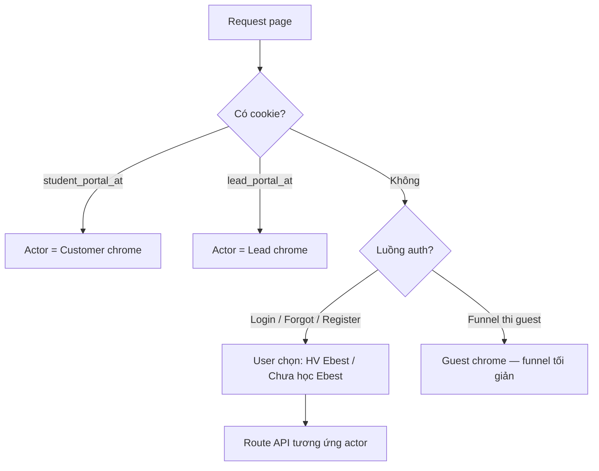

# Lead Portal — Phiên đăng nhập, UI thống nhất & Marketing (SSOT)

> **Phiên bản:** 1.3  
> **Cập nhật:** 2026-07-05  
> **Trạng thái:** **Implementation Ready (P0)** — BL-Q1/Q8 dùng default nếu không phản hồi  
> **Phạm vi:** Student Portal · Mock Test Online funnel · Lead authenticated zone · CRM admin (marketing content)

**Tài liệu liên quan (không nhân đôi):**

| Chủ đề | File |
|--------|------|
| Identity lead → customer, cookie, unified login | [PORTAL_IDENTITY_LEAD_CUSTOMER_TRANSITION_SPEC.md](../../ebest-crm-api/docs/system/PORTAL_IDENTITY_LEAD_CUSTOMER_TRANSITION_SPEC.md) |
| Mock test online funnel | [MOCK_TEST_PUBLIC_ONLINE_FREE_SPEC.md](../../ebest-crm-api/docs/modules/mock-test/MOCK_TEST_PUBLIC_ONLINE_FREE_SPEC.md) |
| **Giới hạn 3 lượt / testTypeCode / lead** | [MOCK_TEST_ONLINE_LEAD_ATTEMPT_LIMIT_SPEC.md](../../ebest-crm-api/docs/modules/mock-test/MOCK_TEST_ONLINE_LEAD_ATTEMPT_LIMIT_SPEC.md) |
| UI học tập HV | [STUDENT_PORTAL_LEARNING_UI.md](./STUDENT_PORTAL_LEARNING_UI.md) |
| React standards | [REACT_CODE_STANDARDS.md](../../ebest-crm-client/docs/standards/REACT_CODE_STANDARDS.md) |

---

## 0. Quyết định đã chốt (PM — 2026-07-05)

| ID | Quyết định | Ghi chú triển khai |
|----|------------|-------------------|
| **LP-D1** | **Tự khai báo vai trò** thay vì suy luận phức tạp khi chưa rõ | UI: «**Đang là học viên Ebest**» / «**Chưa học tại Ebest**» tại login, quên MK, và các luồng auth mơ hồ. **Cookie vẫn là SSOT** khi đã có phiên. |
| **LP-D2** | **Có session → layout đầy đủ** (sidebar + header + thông tin đăng nhập) trên **mọi page** kể cả funnel | Bọc `/mock-test-online/*` bằng `PortalDashboardShell` theo actor cookie — **không** giữ header guest riêng khi đã login. |
| **LP-D3** | **Tối đa 3 lần thi / loại đề / lead** | Enforce CRM; giảm spam tài khoản. Lần 2–3: **không đăng ký intake đầy đủ** — chỉ **Zalo unlock** để giữ liên kết thương hiệu. |
| **LP-D4** | Header auth-aware trên funnel (Q3) | Gộp vào LP-D2 — chrome thống nhất qua dashboard shell. |
| **LP-D5** | Lead có **đủ** hồ sơ, quên MK, đổi MK; dùng LP-D1 khi phân nhánh | Mirror pattern customer; forgot-password lead riêng endpoint. |
| **LP-D6** | Marketing public → **MongoDB + Redis**; Postgres chỉ transactional | Giảm tải CRM DB + bề mặt DDoS read-heavy. |
| **LP-D7** | **Ưu đãi / countdown** | **Nợ tương lai** — không UI countdown P0/P1. |
| **LP-D8** | **Cookie / session-first** — không phụ thuộc URL để suy actor | Route là điểm vào; chrome & gate theo cookie + (khi guest) self-declaration. |
| **LP-D9** | Đếm lượt thi theo **`testTypeCode`** (`mock_test_sessions.test_type_code`) | SSOT: [MOCK_TEST_ONLINE_LEAD_ATTEMPT_LIMIT_SPEC.md](../../ebest-crm-api/docs/modules/mock-test/MOCK_TEST_ONLINE_LEAD_ATTEMPT_LIMIT_SPEC.md) |
| **LP-D10** | **`in_exam` active:** không lượt mới; **resume** nếu còn thời gian (BL-Q2 / AL-D6) | Gate + UI «Tiếp tục làm bài» |
| **LP-D11** | Fast path: **cookie hiện tại**, không đăng ký lại; **Zalo unlock mỗi lần** (BL-Q4 / AL-D7) | |
| **LP-D12** | ~~Mongo `portal_marketing`~~ → **Postgres** `portal_course_catalog` + `portal_site_links` (2026-07-05) | CRM `portal-course-catalog` module; Mongo CRM **đã gỡ** |

---

## 1. Tóm tắt yêu cầu

### 1.1 Mục tiêu nghiệp vụ

| # | Yêu cầu | Diễn giải |
|---|---------|-----------|
| **L1** | Có session → **sidebar + header + tài khoản** mọi nơi | LP-D2 |
| **L2** | Marketing & branding cho lead | Về Ebest, khóa học, tư vấn Zalo/FB |
| **L3** | Giảm tải Postgres | Mongo + Redis (LP-D6) |
| **L4** | Quản trị qua CRM | Admin CRUD → Mongo → invalidate Redis |
| **L5** | Menu trực quan | Thi / Khám phá Ebest / Tài khoản |
| **L6** | Ưu đãi FOMO | **Nợ** (LP-D7) |
| **L7** | Tài khoản lead đầy đủ | Profile, bổ sung thông tin, đổi MK, quên MK (LP-D5) |
| **L8** | Giới hạn spam thi | 3 lần / loại đề / lead; lần sau Zalo-only (LP-D3) |
| **L9** | Đơn giản hóa lead vs customer | Self-declaration (LP-D1) + cookie SSOT (LP-D8) |

### 1.2 Nguyên tắc UX (bắt buộc)

| ID | Nguyên tắc |
|----|------------|
| **UX-1** | Không lộ thuật ngữ nội bộ (lead/customer/omni/upgrade). Copy: «Chưa học tại Ebest» / «Đang là học viên Ebest». |
| **UX-2** | **Cookie quyết định chrome**; URL chỉ là nội dung trang. |
| **UX-3** | Guest chọn vai trò **trước** login/forgot-password khi chưa có cookie. |
| **UX-4** | Customer **không** nhận menu/strip marketing lead (chỉ khi cookie = customer). |
| **UX-5** | Mục tiêu kinh doanh: **giữ liên kết thương hiệu Ebest** (Zalo, portal, branding) — không tạo tài khoản rác. |

---

## 2. Mô hình actor — đơn giản hóa (LP-D1 + LP-D8)

### 2.1 Thứ tự resolve (SSOT)



| Bước | Nguồn | Kết quả |
|------|-------|---------|
| 1 | Cookie `student_portal_at` hợp lệ | **Customer** — menu HV, không hỏi lại |
| 2 | Cookie `lead_portal_at` hợp lệ | **Lead** — menu lead + marketing |
| 3 | Không cookie + trang auth | **Self-declaration** → gọi unified login hoặc lead auth |
| 4 | Không cookie + funnel | **Guest** — layout funnel public; Zalo verify → set cookie lead |

**Không** chain probe `/api/me` rồi `/api/lead/me` trên mọi page khi đã biết cookie — đọc cookie phía BFF/hook trước (hoặc một endpoint `GET /api/portal/session` trả `{ actor, displayName }`).

### 2.2 Self-declaration UI

| Màn | Control |
|-----|---------|
| `/login` | Hai lựa chọn rõ (segmented / card): «Đang là học viên Ebest» · «Chưa học tại Ebest» — **trước** form; cùng form loginId/password |
| `/forgot-password` | Cùng lựa chọn → customer: email; lead: SĐT/email đăng ký thi |
| *(Tùy chọn)* Modal lần đầu guest vào portal | Lưu `sessionStorage` preference **chỉ UX**, không thay cookie |

Sau login thành công: cookie set → **không** hỏi lại.

### 2.3 Silent upgrade (customer đã convert)

Backend `GET /lead/me` vẫn có thể upgrade cookie lead → customer. UI **không** thông báo kỹ thuật — chrome chuyển sang menu HV khi cookie đổi (reload session endpoint).

---

## 3. Chrome thống nhất (LP-D2 — cập nhật)

### 3.1 Ma trận layout (mục tiêu)

| Cookie / actor | Mọi route (kể cả `/mock-test-online/*`) | Layout |
|----------------|----------------------------------------|--------|
| **Guest** | Funnel, login, forgot | Funnel: `MockTestOnlineGuestShell` **hoặc** public branded; **không** sidebar |
| **Lead** | `/lead/*`, `/mock-test-online/*`, … | `PortalDashboardShell` + menu lead + strip marketing (P1) |
| **Customer** | `/(dashboard)/*`, `/mock-test-online/*` nếu vào thi | `PortalDashboardShell` + menu HV |

**Thay đổi so v1.0:** Funnel authenticated **có sidebar** — không còn lớp «chỉ header».

### 3.2 Cấu trúc layout Portal (đề xuất code)

```
app/layout.tsx
  └── PortalChromeGate (client)
        ├── guest → children (funnel guest shell nếu path mock-test-online)
        ├── lead  → LeadAuthenticatedLayoutClient → children
        └── customer → DashboardLayoutClient → children
```

Hoặc: `mock-test-online/layout.tsx` delegate sang `PortalChromeGate` thay vì `MockTestOnlineSiteLayout` cố định.

**Exam run (`/exam/run`):** sidebar **collapsed** mặc định hoặc ẩn menu items phụ — giữ focus làm bài; header vẫn có tài khoản.

### 3.3 Strip marketing (P1)

- Render theo **cookie lead**, không theo URL prefix.
- Customer cookie → không strip.

---

## 4. Giới hạn thi — 3 lần / loại đề / lead (LP-D3)

### 4.1 Quy tắc nghiệp vụ

| Lần | Đăng ký intake | Zalo verify | Ghi chú |
|-----|----------------|-------------|---------|
| **1** | Đầy đủ (form + Zalo) | Bắt buộc | Tạo/link omni lead, provision portal |
| **2–3** | **Rút gọn** — không tạo lead/account mới | **Bắt buộc** mỗi lần | Giữ liên kết Zalo OA |
| **>3** | Chặn | — | Thông báo user-friendly; CTA tư vấn |

**Đếm theo:** `omniLeadId` + `mock_test_type_id` (hoặc `campaign.examVariantKey` — cần khớp spec đề). Store: count registrations `PUBLIC_MOCK_TEST_ONLINE` scored hoặc mọi trạng thái post-verify — **chốt implementation:** count từ `zalo_verified_at IS NOT NULL`.

### 4.2 Flow lần 2–3 (guest đã có cookie lead)

1. User (cookie lead) chọn «Đăng ký thi mới» từ menu.  
2. CRM check count < 3 → cho phép **fast path**: chọn đề → Zalo unlock (có thể skip form intake nếu profile đủ).  
3. Không provision account mới; reuse `lead_portal_at`.

### 4.3 Ảnh hưởng code hiện có

| Vùng | Việc |
|------|------|
| CRM intake | Gate `attemptCountByOmniLeadAndExamType` |
| Gateway / campaign | `maxAttemptsPerPhone` align 3 — cập nhật spec mock-test |
| Portal | Hiển thị lỗi thân thiện khi API 409/403 limit |

Cross-ref: bổ sung § vào `MOCK_TEST_PUBLIC_ONLINE_FREE_SPEC.md` khi implement (không nhân đôi logic ở đây).

---

## 5. Menu lead (tổ chức trực quan)

### 5.1 Sidebar

**Kết quả & thi**

| Label | Path |
|-------|------|
| Kết quả thi thử | `/lead/tests` |
| Đăng ký thi mới | `/mock-test-online/register` |

**Khám phá Ebest** *(P1)*

| Label | Path |
|-------|------|
| Về Ebest | `/lead/about` |
| Các khóa học | `/lead/courses` |
| ~~Ưu đãi~~ | **Nợ** (LP-D7) |

**Tài khoản** *(P0–P1)*

| Label | Path |
|-------|------|
| Thông tin cá nhân | `/lead/profile` |
| Đổi mật khẩu | `/lead/change-password` |

Quên mật khẩu: public flow + LP-D1 (không item menu).

### 5.2 Strip CTA *(P1, cookie lead only)*

Khóa học · Về Ebest · Tư vấn (Zalo / Facebook).

---

## 6. Kiến trúc dữ liệu marketing (LP-D6)

### 6.1 Phân tầng

| Store | Dữ liệu |
|-------|---------|
| **PostgreSQL** | Lead account, registration, scores, credentials, attempt limits |
| **MongoDB** | Marketing CMS (about, courses, consult links) — **offers deferred** |
| **Redis** | Cache read-model; rate limit public reads |

### 6.2 Read path (public / authenticated)

```
GET /api/portal/marketing (BFF)
  → Redis GET portal:marketing:vi-VN
  → miss: CRM read Mongo → SET Redis
Auth: optional — consult links có thể public cached
```

**Mục tiêu chống DDoS:** endpoint read-only, cached, không join Postgres.

### 6.3 Schema Mongo (rút gọn — không offers P1)

```typescript
type PortalMarketingDoc = {
  locale: 'vi-VN';
  consult: { zaloUrl: string; facebookUrl: string };
  about: { title: string; blocks: Array<{ heading?: string; bodyHtml: string }> };
  courses: Array<{ id: string; title: string; summary: string; imageUrl?: string; ctaUrl?: string; sortOrder: number }>;
  updatedAt: string;
};
// offers[] + endsAt — LP-D7 future
```

---

## 7. Tài khoản lead (LP-D5)

| Chức năng | Customer | Lead | Self-declaration |
|-----------|----------|------|------------------|
| Login | ✅ unified + chọn «HV Ebest» | ✅ unified + chọn «Chưa học» | LP-D1 |
| Forgot password | ✅ email | ✅ **mới** SĐT/email thi | LP-D1 |
| Change password | ✅ | ✅ **mới** | — |
| Profile view/edit | ✅ | ✅ **mới** | — |

Logout: **một endpoint** xóa cả hai cookie (`POST /api/auth/portal/logout`).

---

## 8. Nền tảng as-built & gap

### 8.1 Đã có — tái sử dụng

`PortalDashboardShell`, `LeadAuthenticatedLayoutClient`, `probePortalSession`, `session-routes`, `provisionLeadPortalSession`, unified `/login`.

### 8.2 Gap cập nhật

| ID | Gap | Phase |
|----|-----|-------|
| G-UI-1 | Funnel chưa bọc dashboard shell khi có cookie | **P0** |
| G-UI-2 | Self-declaration chưa có trên login/forgot | **P0** |
| G-AUTH-1 | Lead forgot-password API | **P0** |
| G-AUTH-2 | Portal logout unified | **P0** |
| G-EXAM-1 | Limit 3 attempts / type / lead | **P0–P1** |
| G-DATA-1 | Mongo + Redis marketing | **P1** |
| G-PROMO-1 | Countdown offers | **Future** (LP-D7) |

---

## 9. Kế hoạch triển khai

### P0 — Session, chrome, auth (sprint 1)

| # | Việc |
|---|------|
| P0-1 | `GET /api/portal/session` — cookie-first `{ actor, displayName, avatarUrl? }` |
| P0-2 | `PortalChromeGate` — bọc funnel + lead routes |
| P0-3 | Self-declaration UI login + forgot-password |
| P0-4 | Lead change-password + forgot-password (CRM + BFF) |
| P0-5 | `POST /api/auth/portal/logout` |
| P0-6 | CRM: gate 3 attempts / exam type / omniLeadId |
| P0-7 | Fast path lần 2–3 (Zalo-only, skip intake) |
| P0-8 | QA checklist §10 |

### P1 — Marketing Mongo/Redis

| # | Việc |
|---|------|
| P1-1 | Mongo module CRM + admin CRUD |
| P1-2 | Redis cache + public read BFF |
| P1-3 | Pages `/lead/about`, `/lead/courses` |
| P1-4 | Menu lead + marketing strip (cookie lead) |
| P1-5 | `/lead/profile` |

### Future (LP-D7)

| # | Việc |
|---|------|
| F-1 | Trang ưu đãi + countdown FOMO |
| F-2 | Offer cá nhân hóa / auto-assign |

---

## 10. Checklist QA (P0)

- [ ] Guest funnel: không sidebar; login có 2 lựa chọn vai trò
- [ ] Sau Zalo + cookie lead: `/mock-test-online/register` **có sidebar + header** tài khoản
- [ ] Customer cookie trên funnel: menu HV, không strip lead
- [ ] Lần thi 4 cùng loại đề: bị chặn, message thân thiện + tư vấn
- [ ] Lần 2–3: Zalo unlock, không form intake đầy đủ
- [ ] Logout xóa sạch cookie; login lại đúng actor đã chọn
- [ ] Không copy kỹ thuật lead/customer trên UI

---

## 11. Definition of Ready — triển khai P0

- [x] LP-D1 … LP-D8 chốt  
- [ ] Migration portal identity trên staging  
- [ ] Spec mock-test cập nhật § attempt limit (cross-ref)  
- [ ] Endpoint `GET /api/portal/session` thiết kế review  

---

## 12. Kết luận

- **Đơn giản hóa cốt lõi:** cookie quyết định chrome; guest **tự khai báo** vai trò ở auth; bỏ suy luận phức tạp khi không cần.  
- **LP-D2:** có session = **sidebar + header everywhere** — sửa gap funnel/register.  
- **LP-D3:** 3 lần thi / loại đề — anti-spam + Zalo retention.  
- **LP-D6–D7:** Mongo/Redis marketing; **không** countdown ưu đãi bây giờ.  
- **LP-D8:** logic theo cookie/session, URL chỉ là điểm render nội dung.

---

## 13. Điểm mù logic — đã làm rõ vs còn mở

### 13.1 Đã chốt (không hỏi lại)

| Chủ đề | Quyết định |
|--------|------------|
| Phân biệt lead/customer khi mơ hồ | Self-declaration «HV Ebest» / «Chưa học tại Ebest»; **cookie thắng** khi đã login |
| Chrome khi có session | Sidebar + header **mọi page** (LP-D2) |
| Giới hạn spam thi | 3 lượt / `testTypeCode` / `omniLeadId`; lượt 2–3 Zalo-only |
| Khóa đếm lượt | `zalo_verified_at IS NOT NULL` (AL spec §2.1) |
| Ưu đãi countdown | **Nợ** (LP-D7) |
| Marketing store | Mongo + Redis (LP-D6) |
| Không lộ jargon nội bộ | UX-1 |

### 13.2 Còn mở / đã chốt

| ID | Trạng thái | Quyết định |
|----|------------|------------|
| **BL-Q1** | Default | Đã Zalo → **tính** 1 lượt (kể cả bỏ dở `in_exam`) |
| **BL-Q2** | ✅ **Chốt** LP-D10 | **Không** lượt mới khi `in_exam`; **resume** nếu còn thời gian |
| **BL-Q3** | Default | Customer cookie → menu HV, kết quả `/mock-test-results` |
| **BL-Q4** | ✅ **Chốt** LP-D11 | Cookie hiện tại, **không** đăng ký lại; **Zalo unlock** mỗi lần |
| **BL-Q5** | Default | `/lead/register` → redirect `/login` |
| **BL-Q6** | Default | `?embed=1` sidebar collapsed |
| **BL-Q7** | Default | Admin reset lượt — P2 |
| **BL-Q8** | Default | Login «Chưa học» — **không** fallback customer |
| **BL-Q9** | ✅ **Chốt** LP-D12 | Cùng `MONGODB_URI` Gateway quiz; collection `portal_marketing` |

### 13.3 Mâu thuẫn spec cũ — cách xử lý

| Spec cũ | Mới | Cách reconcile |
|---------|-----|----------------|
| `max_attempts_per_phone = 1` / campaign | Global 3 / testTypeCode | **AL-D5:** check global trước; session cap per campaign vẫn áp dụng |
| PO-5 retake same session | Retake có thể **campaign khác** cùng type | Cập nhật FREE_SPEC cross-ref — không đổi code session default |
| Re-intake supersede SĐT | Fast path reuse **omniLeadId** | Supersede chỉ registration `pending`/`zalo_verified` chưa vào thi — giữ util hiện có |

---

## 14. Điểm mù kỹ thuật — phân tích & phương án

### 14.1 Session endpoint (P0-1)

**Vấn đề:** Probe kép `/api/me` + `/api/lead/me` — chậm, race, khác `useAuth` trên funnel.

**Phương án:**

```
GET /api/portal/session
  BFF đọc cookie (ưu tiên student_portal_at → lead_portal_at)
  → nếu student: proxy GET /student/me (cached 30s client)
  → nếu lead: proxy GET /lead/me
  → none: { actor: 'none' }
```

Response:

```typescript
type PortalSessionResponse = {
  actor: 'none' | 'lead' | 'customer';
  displayName: string | null;
  avatarUrl?: string | null;
  omniLeadId?: string | null; // lead only — cho attempt pre-check
};
```

**Không** trả JWT / email internal.

### 14.2 PortalChromeGate (P0-2)

**Vấn đề:** `mock-test-online/layout.tsx` luôn `MockTestOnlineSiteLayout` guest.

**Phương án:** Layout client đọc `usePortalSession()`:

| actor | Wrapper |
|-------|---------|
| `none` | `MockTestOnlineGuestShell` (header guest) |
| `lead` | `LeadAuthenticatedLayoutClient` |
| `customer` | `DashboardLayoutClient` (initialClasses optional empty) |

`/exam/run`: prop `examFocus` → sidebar collapsed, ẩn strip.

### 14.3 Logout thống nhất (P0-5)

**Vấn đề:** Logout customer không xóa cookie lead → probe lệch.

**Phương án:** `POST /api/auth/portal/logout` → `clearStudentAccessTokenCookie` + `clearLeadAccessTokenCookie`.

### 14.4 Self-declaration persistence (LP-D1)

**Vấn đề:** User chọn sai vai trò → login fail.

**Phương án:**

- UI: segmented control **trước** form; gửi `loginContext: 'customer' | 'lead'` trong body.
- CRM unified login: nếu `loginContext=customer` → **chỉ** thử customer trước; `lead` → customer fallback (giữ PI-D11) **hoặc** lead-only tùy BL-Q8 bên dưới.
- **Không** lưu preference server — chỉ session form.

| ID | Câu hỏi | Đề xuất |
|----|---------|---------|
| **BL-Q8** | Login «Chưa học» có fallback thử customer không? | **Không** — tránh nhầm; copy gợi ý «Nếu bạn là học viên, chọn tab bên trên» |

### 14.5 Course catalog Postgres — LP-D12 (pivot 2026-07-05)

**Quyết định hiện hành:** Marketing portal lead dùng **Postgres**, không Mongo trên CRM API.

| Thành phần | SSOT |
|------------|------|
| Tables | `portal_course_catalog`, `portal_site_links` |
| Public API | `GET /api/v1/student/portal/explore` (gộp) |
| Admin | `GET/POST/PUT/DELETE /api/v1/portal-course-catalog` |
| CRM Client | `/student-portal/course-catalog` |
| Spec | [PORTAL_COURSE_CATALOG_SPEC.md](../../ebest-crm-api/docs/modules/student-portal/PORTAL_COURSE_CATALOG_SPEC.md) |

**Redis:** `portal:catalog:{locale}`, `portal:site-links:{locale}` — TTL 600s.

**Legacy compat:** Portal BFF `/api/portal/marketing` map từ explore Postgres (không gọi Mongo).

~~Mongo `portal_marketing`~~ — deprecated, module CRM đã gỡ 2026-07-05.

### 14.6 Redis & DDoS (LP-D6)

| Endpoint | Cache | Rate limit |
|----------|-------|------------|
| `GET /api/portal/explore` | Redis TTL 10m (CRM) + BFF s-maxage 600 | IP 60/min |
| `GET /api/portal/marketing` | **Deprecated** — delegate explore | IP 60/min |
| `GET /api/portal/session` | Không cache (cookie) | — |
| Public consult links only | Redis | IP 120/min |

Invalidate: CRM admin CRUD catalog / `POST portal-course-catalog/invalidate-cache`.

### 14.7 Attempt limit implementation

SSOT code mới:

- `countVerifiedOnlineAttemptsByLeadAndTestType(omniLeadId, testTypeCode)`
- Gate tại: Gateway intake (mirror CRM), CRM `select-exam`, CRM internal unlock-consumed
- Error code: `MOCK_TEST_ONLINE_ATTEMPT_LIMIT`

Portal: trước `/mock-test-online/register`, gọi `GET /api/public/mock-test-online/attempt-status?testTypeCode=` (cached 1 phút).

### 14.8 Auth context skip trên funnel

**Vấn đề:** `isPublicAnonymousPortalPath` → `useAuth` không refresh → dashboard children confused.

**Phương án:** Funnel **không** dùng `useAuth` cho chrome; chỉ `usePortalSession`. Dashboard routes giữ `useAuth`.

### 14.9 Migration & silent upgrade

**Vấn đề:** Migration `portal_identity` chưa prod → provision/upgrade fail.

**Gate P0:** migration chạy staging + smoke AC portal identity trước UI work.

---

## 15. Ma trận trạng thái UI (cookie × route)

| Cookie | `/mock-test-online/register` | `/lead/tests` | `/login` |
|--------|------------------------------|---------------|----------|
| none | Guest shell | Redirect login | Self-declaration + form |
| lead | **Lead dashboard shell** | Lead shell | Redirect `/lead/tests` |
| customer | **Customer dashboard shell** | Redirect `/mock-test-results` | Redirect `/` |

**Không** suy từ URL — chỉ cookie (+ redirect rules trên).

---

## 16. Definition of Ready — cập nhật

### P0 ready khi:

- [x] LP-D1 … LP-D12
- [x] BL-Q2, BL-Q4, BL-Q9
- [ ] BL-Q1, BL-Q8 — **default áp dụng** nếu không đổi
- [ ] Migration portal identity staging OK

### P1 ready khi:

- [x] LP-D12 — Postgres `portal_course_catalog` + CRM Client admin
- [ ] P0 shipped

---

## 17. Tracker cross-ref

Cập nhật [LEAD_PORTAL_WORK_TRACKER.md](./LEAD_PORTAL_WORK_TRACKER.md) + CRM [MOCK_TEST_ONLINE_LEAD_ATTEMPT_LIMIT_SPEC.md](../../ebest-crm-api/docs/modules/mock-test/MOCK_TEST_ONLINE_LEAD_ATTEMPT_LIMIT_SPEC.md).

---

## 18. Kết luận v1.3

- **Self-declaration + cookie-first** thay cho suy luận phức tạp lead/customer.
- **Attempt limit** tách spec CRM — đếm theo `testTypeCode`, trigger tại `zalo_verified_at`.
- **BL-Q2 / BL-Q4 / BL-Q9 đã chốt** — `in_exam` resume-only; fast path cookie + Zalo; Mongo marketing cùng URI Gateway.
- **Còn mở (default P0):** BL-Q1 (đếm lượt nếu đã Zalo), BL-Q8 (login «Chưa học»).
- **P0 kỹ thuật:** `PortalChromeGate`, `GET /api/portal/session`, attempt gate + fast path trong code.
