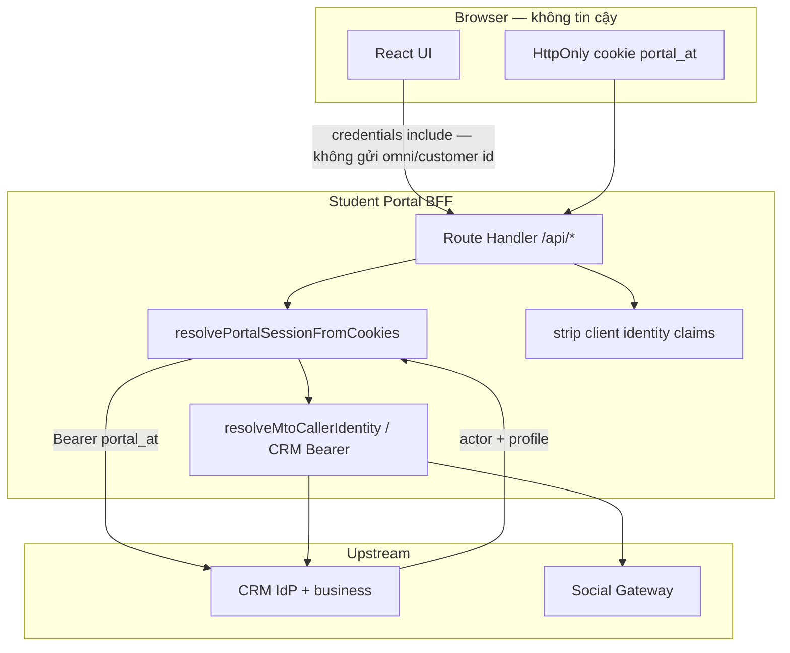

# Portal BFF — Auth cookie · Token proxy · Tái sử dụng identity (SSOT)

> **Phiên bản:** 1.3  
> **Cập nhật:** 2026-08-01  
> **Trạng thái:** **CANONICAL mục tiêu + as-built**  
> **Phạm vi:** Student Portal (Next.js) · CRM IdP · Gateway (chỉ nhận identity đã resolve từ BFF/CRM)  
> **Liên quan:** [SECURITY_STANDARDS](../../ebest-crm-api/docs/monorepo/standards/SECURITY_STANDARDS.md) · [BFF_RESPONSE_SECURITY](./STUDENT_PORTAL_BFF_RESPONSE_SECURITY_SPEC.md) · [UPA](../../ebest-crm-api/docs/monorepo/portal-identity/UNIFIED_PORTAL_AUTHENTICATION_SPEC.md) · [SIX_STEP_FLOW](../../ebest-crm-api/docs/modules/mock-test/MOCK_TEST_ONLINE_SIX_STEP_FLOW_ANALYSIS.md) · [DROP_RESUME](../../ebest-crm-api/docs/modules/mock-test/MOCK_TEST_ONLINE_DROP_RESUME_AND_RESULTS_AS_BUILT.md)

---

## 0. Mục tiêu tối ưu (đã chốt với product/engineering)

| # | Nguyên tắc |
|---|------------|
| **A1** | Cookie `portal_at` là **điểm vào identity** trên Student Portal — BFF đọc cookie, không tin body UI. |
| **A2** | Proxy `/api/*` gửi upstream kèm **Bearer token** (và/hoặc service key). **Lead/customer/omni id** chỉ inject **server-side** sau khi resolve session. |
| **A3** | Client UI **không** gửi `omniLeadId` / `customerId` / `accountId` / `leadAccountId` lên BFF để “tự nhận” identity. |
| **A4** | Thông tin người đăng nhập resolve **một lần** (hoặc cache ngắn theo request) → **tái sử dụng** trong select / attempt-status / authorize / exam-home. |
| **A5** | API CRM/GW chuẩn hóa: auth = JWT portal hoặc M2M; business logic nhận identity đã verify — không decode cookie ở Gateway từ browser. |

---

## 1. Ranh giới tin cậy



**Cấm:** UI gọi Gateway public kèm `omniLeadId` tự khai.  
**Đúng:** UI → BFF (cookie) → BFF gắn Bearer / inject id → CRM hoặc GW.

---

## 2. Chuẩn authentication

### 2.1 Cookie & token

| Thành phần | Vai trò |
|------------|---------|
| `portal_at` | JWT `purpose=portal` — Lead hoặc Customer (UPA) |
| BFF → CRM | `Authorization: Bearer <portal_at>` |
| BFF → GW (MTO public qua BFF) | Service key + body đã strip/inject identity |
| GW → CRM (M2M) | `CRM_SERVICE_KEY` |
| `portalAuthorizeToken` | HMAC capability **làm bài** — mint tại BFF từ session; không thay identity cookie |

### 2.2 Resolve session (SSOT Portal)

```text
getPortalAccessTokenFromCookie()
  → GET CRM /student/portal/session (Bearer)
  → PortalSessionPayload: guest | lead | customer
```

- Actor do **CRM** quyết định sau verify JWT.  
- BFF **không** decode `accountType` từ JWT để quyết nghiệp vụ (PO-D16).

### 2.2.1 Vùng route & phục hồi phiên (BFF-ID-6) — 2026-08-01

| Vùng | Ai được vào | Khi JWT invalid / CRM 401·403 |
|------|-------------|-------------------------------|
| **Public** (whitelist đã chốt: login, forgot/reset, MTO browse/register/exam focus, …) | Guest OK | Soft: `actor: 'guest'`; **không** ép login; **không** publish system error |
| **Auth-required** (`(dashboard)/**`, `lead/(authenticated)/**`, API `/api/student/*`, `/api/lead/*`, MTO auth-first) | Customer và/hoặc Lead | **Hard recovery**: clear cookie → `/login?session=expired&returnUrl=…` |
| **Probe** `GET /api/portal/session` | Ai cũng gọi | Soft guest (HTTP 200); flag `authFailure` khi cookie từng có nhưng CRM từ chối |

**Phân loại lỗi CRM `portal/session`:**

| Status | UX / payload | Log platform |
|--------|--------------|--------------|
| Không cookie | `{ actor: 'guest' }` | Không |
| **401 / 403** | clear cookie + `{ actor: 'guest', authFailure: 'expired' }` | **Không** (expected auth lifecycle) |
| Identity upgrade (re-login) | clear + `{ actor: 'guest', authFailure: 'relogin_required' }` | Không |
| 5xx / network | guest (hoặc throw connection) | **Có** (`PORTAL_SESSION_HTTP` / `NETWORK`) |

**Auth-required layout / client:**

1. Guest **không** cookie → `/login?returnUrl=…` (chưa đăng nhập).  
2. Guest có `authFailure: 'expired' | 'relogin_required'` → `/login?session=expired&returnUrl=…`.  
3. API nghiệp vụ BFF trả 401 → clear cookie + client `recoverInvalidPortalSession` (logout + hard navigate login expired).  
4. Dùng `fetchWithAuth` / lead client-api wrapper — **không** để UI “chết” im lặng trên trang đòi quyền.

Helpers: `lib/portal-auth/portal-session-recovery.ts` · middleware gắn `x-portal-pathname` cho returnUrl SSR.

### 2.3 Resolve identity nghiệp vụ MTO (tái sử dụng)

| Actor | Nguồn id | Phone (gate session_cap) |
|-------|----------|---------------------------|
| Lead | `session.omniLeadId` + profile từ portal/session | `session.profile.phoneE164` |
| Customer | **Ưu tiên** `session.customer.omniLeadId` + `primaryPhone` trên portal/session; **fallback** bootstrap CRM khi chưa stamp omni | phone từ session hoặc bootstrap |
| Guest | Không MTO auth-first | — |

Helper SSOT (as-built):  
`ebest-student-portal/src/features/portal-mock-test/server/resolve-mto-caller-identity.server.ts`

---

## 3. Chuẩn proxy BFF

### 3.1 Checklist mỗi Route Handler

1. Đọc cookie → `resolvePortalSessionFromCookies` (hoặc proxy helper đã Bearer).  
2. Guest → 401.  
3. **Xóa** mọi claim identity từ body/query client (`omniLeadId`, `customerId`, `accountId`, `leadAccountId`, …).  
4. Inject identity server-only khi upstream cần.  
5. Gọi CRM/GW; map lỗi qua `sanitize` / `mapPortalConflictForClient`.  
6. Không passthrough JSON nội bộ (SP-SEC-1).

### 3.2 Phân loại API

| Loại | Auth | Identity |
|------|------|----------|
| CRM student/lead (`/api/lead/*`, `/api/me/*`, portal mock-test) | Bearer cookie | CRM `@CurrentLead` / `@CurrentStudent` / PortalJwt |
| MTO BFF → CRM select | Bearer cookie | CRM resolve từ JWT — body chỉ `sessionId` (+ variant) |
| MTO BFF → GW authorize-resume | Cookie session + inject `omniLeadId` | `buildAuthorizeResumeBody` strip client claim |
| MTO BFF → GW quiz-runtime | Cookie + mint HMAC theo `registrationId` header | Không gửi omni từ UI |
| Public SEO/campaign list | Có thể public | Không identity |

### 3.3 Client UI được gửi gì?

| Được | Không được |
|------|------------|
| `sessionId`, `testVariantChoice`, `registrationId` (capability scope đã bind), đáp án quiz | `omniLeadId`, `customerId`, `accountId`, `leadAccountId`, tự bịa Bearer |
| `credentials: 'include'` | Token trong `localStorage` / query |

---

## 4. Tái sử dụng data (tối ưu)

### 4.1 Đã có / đang chuẩn hóa

| Data | Tái sử dụng |
|------|-------------|
| `portal/session` | Layout / select SSR / principal |
| `my-exam-home` | Gate select + pending + activeReady/InExam (tránh double attempt-status khi có embed) |
| Mint HMAC cache | Theo `registrationId` trên BFF — quiz-runtime |
| Mirror Redis GW | Status registration khi resume |
| Pending Zalo Redis | Confirm cross-tab theo `accountId` |

### 4.2 Mục tiêu tiếp theo (không phá SoT)

| Hạng mục | Hướng |
|----------|--------|
| Customer `omniLeadId` | ✅ Embed trong CRM `me` / `portal/session` (`toSafeCustomer`); BFF ưu tiên session, bootstrap chỉ khi thiếu |
| `my-exam-home` | TTL Redis ngắn (vài giây) theo `accountId` nếu home bị gọi dày |
| Results | Giữ PG SoT; không “cache điểm” trên browser làm SoT |
| Attempt-status trên results | Có thể bỏ nếu list CRM đã có `in_exam` |

---

## 5. As-built vs mục tiêu

| Nguyên tắc | As-built | Gap |
|------------|----------|-----|
| A1 Cookie → session | ✅ `resolvePortalSessionFromCookies` | — |
| A2 Proxy Bearer / inject id | ✅ select-exam-account; authorize-resume strip+inject | Một số route cũ còn lặp code — gom helper |
| A3 UI không gửi omni | ✅ client API select không gửi; authorize strip | Audit định kỳ mọi BFF |
| A4 Tái sử dụng | ✅ session embed omni (customer); mint cache; bootstrap fallback khi thiếu | Optional: TTL ngắn my-exam-home |
| A5 Chuẩn API | ✅ CRM PortalJwt; GW M2M/HMAC | Document + checklist PR |

---

## 6. Code map

| Concern | File |
|---------|------|
| Cookie read | `lib/portal-auth-cookie.ts` |
| Session resolve | `lib/portal-auth/resolve-portal-session.server.ts` |
| Session recovery (auth zone) | `lib/portal-auth/portal-session-recovery.ts` |
| Pathname header constant | `lib/portal-auth/portal-pathname-header.ts` |
| Pathname SSR (`x-portal-pathname`) | `src/middleware.ts` + `lib/portal-auth/get-portal-request-path.server.ts` |
| CRM proxy Bearer | `lib/crm-student-proxy.ts` |
| MTO caller identity | `features/portal-mock-test/server/resolve-mto-caller-identity.server.ts` |
| Authorize body strip | `features/portal-mock-test/server/authorize-resume-body.server.ts` |
| Mint HMAC cache | `lib/public-mock-test-online/mint-mto-portal-authorize-token.server.ts` |
| Select BFF | `app/api/public/mock-test-online/select-exam-account/route.ts` |

---

## 7. Checklist PR (BFF / MTO)

- [ ] Route có auth đọc cookie / Bearer proxy — không nhận identity từ body UI  
- [ ] Body đã `delete` omni/customer/account id trước forward  
- [ ] Dùng helper identity dùng chung (không copy-paste lead vs customer)  
- [ ] Auth-required: 401/expired → logout + `/login?session=expired` (BFF-ID-6); không report 401 `portal/session` lên platform  
- [ ] Không thêm `NEXT_PUBLIC_*` secret  
- [ ] Lỗi client đã sanitize (SP-SEC)  
- [ ] Không tăng round-trip CRM nếu đã có data trên session/home  

---

## 8. SSR shell & hybrid seed (2026-07-28)

**Canonical:** [PORTAL_SSR_SHELL_AND_IDENTITY_SPEC](./PORTAL_SSR_SHELL_AND_IDENTITY_SPEC.md)

### 8.1 Tóm tắt as-built

| Layer | SSOT | Gap |
|-------|------|-----|
| CRM read | `GET portal/session` — actor + profile spread | ✅ Đủ |
| Portal SSR | `resolvePortalSessionFromCookies()` ở root + guards | ⚠️ Nested layout gọi lại `student/me` |
| Client identity | `PortalSessionProvider` + `AuthProvider` | ⚠️ Client DTO chỉ `{ actor, displayName }` → re-fetch `/api/me` |
| Chrome | `PortalChromeGate` (client) | ⚠️ Spinner + waterfall sau hydrate |

### 8.2 Mục tiêu BFF (bổ sung v3)

| # | Nguyên tắc |
|---|------------|
| **A6** | Một request Next → **một** CRM `portal/me` (React `cache()`) |
| **A7** | SSR seed **`PortalMeClient`** — `actor` + layout fields; strip omni |
| **A8** | Read **một** `GET /api/me` → CRM `portal/me`; PATCH giữ path actor cũ tạm |
| **A9** | CRM Redis **`portal:me:{accountId}`** TTL **3600s** — lead + customer |

**CRM spec:** [PORTAL_UNIFIED_ME_CACHE_SPEC.md](../../ebest-crm-api/docs/modules/student-portal/PORTAL_UNIFIED_ME_CACHE_SPEC.md)

### 8.3 Phase triển khai (v3)

| Wave | PR | Mô tả |
|------|-----|-------|
| CRM | CRM-1…3 | `PortalMeCacheService`, `GET portal/me`, invalidate |
| Portal | PR-1…5 | `getCachedPortalMe`, unified `/api/me`, seed layout by `actor` |
| Portal | PR-6 | RSC chrome L3 |

Chi tiết: [PORTAL_SSR_UNIFIED_ME_IMPLEMENTATION_PLAN.md](./PORTAL_SSR_UNIFIED_ME_IMPLEMENTATION_PLAN.md) · [PORTAL_SSR_SHELL v3.1](./PORTAL_SSR_SHELL_AND_IDENTITY_SPEC.md).

---

## 9. Quyết định khóa

| ID | Nội dung |
|----|----------|
| **BFF-ID-1** | Identity SoT trên Portal = cookie `portal_at` + CRM `portal/session` |
| **BFF-ID-2** | Upstream chỉ nhận id do BFF/CRM inject — không tin client claim |
| **BFF-ID-3** | Capability exam (HMAC) ≠ identity; mint server-side, cache theo registration |
| **BFF-ID-4** | Tối ưu = tái sử dụng session/home/mirror/mint — không chuyển SoT điểm/registration sang Redis browser |
| **BFF-ID-5** | SSR shell = Unified `/me` (**SSR-ADR-7/8/9**) — CRM `portal/me` + BFF `GET /api/me`; cache Redis `portal:me:{accountId}` 60p |
| **BFF-ID-6** | Auth-required + JWT invalid → logout + login (`session=expired`); soft-guest chỉ cho public/probe; 401 session **không** lên log platform |

---

## Liên kết module Mock Test

- Phân tích 6 bước: [MOCK_TEST_ONLINE_SIX_STEP_FLOW_ANALYSIS.md](../../ebest-crm-api/docs/modules/mock-test/MOCK_TEST_ONLINE_SIX_STEP_FLOW_ANALYSIS.md)
- Drop/resume/results: [MOCK_TEST_ONLINE_DROP_RESUME_AND_RESULTS_AS_BUILT.md](../../ebest-crm-api/docs/modules/mock-test/MOCK_TEST_ONLINE_DROP_RESUME_AND_RESULTS_AS_BUILT.md)
