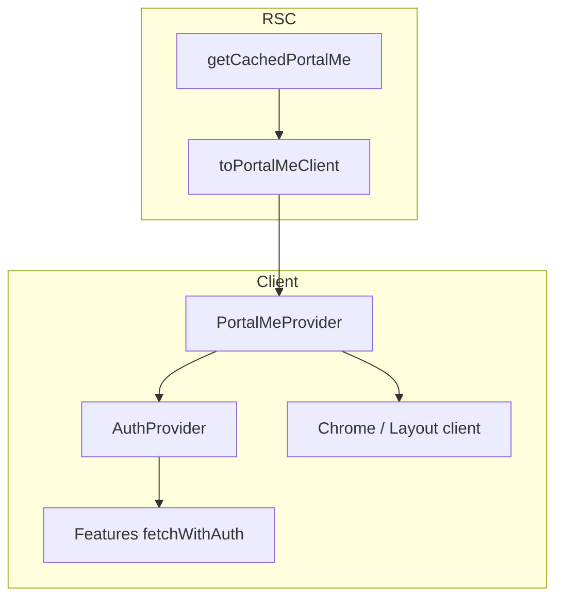

# Portal SSR — Phân tích tác động & chuẩn Next.js App Router

> **Phiên bản:** 1.0  
> **Cập nhật:** 2026-07-28  
> **Trạng thái:** **IMPACT ANALYSIS** — bổ sung cho [PORTAL_SSR_UNIFIED_ME_IMPLEMENTATION_PLAN.md](./PORTAL_SSR_UNIFIED_ME_IMPLEMENTATION_PLAN.md)  
> **Spec:** [PORTAL_SSR_SHELL_AND_IDENTITY_SPEC.md](./PORTAL_SSR_SHELL_AND_IDENTITY_SPEC.md) v3.1  
> **Tiêu chuẩn umbrella:** [NEXTJS_PORTAL_STANDARDS.md](../../ebest-crm-api/docs/monorepo/standards/NEXTJS_PORTAL_STANDARDS.md)

---

## 1. Tóm tắt

Triển khai unified `/me` + SSR seed **không** refactor toàn bộ Portal — chỉ chuẩn hóa **identity + chrome + layout gate**. Phần lớn feature (learning, schedule, invoices) **giữ nguyên** `fetchWithAuth` — chỉ phụ thuộc cookie, không phụ thuộc cách seed profile.

| Nhóm | Số file ước lượng | Mức thay đổi |
|------|-------------------|--------------|
| Server identity SSOT | ~18 | **P0** — migrate `getCachedPortalMe` |
| Context / Provider | 2–3 | **P0** — seed + skip fetch |
| Layout / Chrome | 8 | **P1** — props + RSC guard dần |
| Login / post-auth | 4 | **P1** — giữ fetch sau mutation |
| MTO server guards | ~12 | **P0** — dedupe session |
| Dashboard data hooks | ~15 | **Giữ** — không đổi |
| BFF Route Handlers | 3 read + giữ PATCH | **P1** |

---

## 2. Chuẩn Next.js App Router (best practice — đã chốt)

### 2.1 Nguyên tắc render

| # | Quy tắc | Áp dụng |
|---|---------|---------|
| **NX-1** | **Một** server fetch identity / request: `getCachedPortalMe()` bọc `React cache()` | Root + mọi RSC cần actor |
| **NX-2** | RSC **redirect/guard** theo `actor` — không để client `useEffect` redirect zone | `(dashboard)/layout`, lead authenticated |
| **NX-3** | Client Component nhận **serializable seed props** (`PortalMeClient`) — không fetch identity on mount | Chrome, AuthProvider |
| **NX-4** | Server-only fields (`omniLeadId`, `accountId`) **không** qua props client | PI-D18 |
| **NX-5** | Mutation → `router.refresh()` hoặc `refreshMe()` — không mutate seed tay | Profile PATCH |
| **NX-6** | Route Handler **không** dùng `React cache()` — mỗi request độc lập | `/api/me`, `/api/portal/session` |
| **NX-7** | Client islands chỉ cho **tương tác** (menu collapse, logout, form) | PortalDashboardShell |
| **NX-8** | Partial data (lists, exam) vẫn **client fetch** `/api/*` sau shell ready | Results, assignments |

### 2.2 Sơ đồ layer (mục tiêu)

```text
┌─────────────────────────────────────────────────────────┐
│ app/layout.tsx (RSC)                                     │
│   me = await getCachedPortalMe()  // 1× CRM / request   │
│   seed = toPortalMeClient(me)                           │
│   <PortalMeProvider initialMe={seed}>                   │
│     <AuthProvider ... seedComplete>                     │
│       {children}                                        │
├─────────────────────────────────────────────────────────┤
│ Nested layout (RSC) — optional guard                    │
│   assertActor('customer') → redirect                    │
│   pass initialClasses / props — NO second CRM me fetch  │
├─────────────────────────────────────────────────────────┤
│ Page (RSC or client)                                    │
│   Server page: read me from cache() same reference      │
│   Client page: usePortalMe() + fetchWithAuth for APIs   │
└─────────────────────────────────────────────────────────┘
```

### 2.3 Anti-pattern cần loại bỏ

| Anti-pattern | Hiện tại | Thay bằng |
|--------------|----------|-----------|
| Client probe identity on mount | `AuthProvider` → `/api/me` | Seed + `seedComplete` |
| Duplicate CRM read cùng request | layout + dashboard + MTO page | `getCachedPortalMe()` |
| Client chọn chrome từ loading actor | `PortalChromeGate` spinner | Seed `actor` known at hydrate |
| `fetchStudentMeForSsr` song song session | dashboard layout | Classes từ cached me |
| `classes: []` hardcode | `CustomerPortalChromeClient` | `initialClasses` từ seed |
| Server map drop `classes` | `resolve-portal-session` customer branch | Parse full me payload |

### 2.4 Anti-pattern **giữ** (hợp lệ)

| Pattern | Khi nào |
|---------|---------|
| `fetchLeadProfile()` sau **login** | Token mới — chưa có SSR seed |
| `fetchWithAuth('/api/classes')` | Business data, không identity |
| `resolvePortalSessionFromCookies` trong Route Handler | Cookie mutate / force logout |
| `GET /api/portal/session` minimal refresh | Chỉ cần actor + displayName sau login client |

---

## 3. Ma trận tác động theo domain

Chú thích: **Δ P0** bắt buộc wave B · **Δ P1** cùng wave · **Δ P2** hardening · **=** giữ nguyên

### 3.1 Server identity & helpers

| File / module | Vai trò hiện tại | Hành động | PR |
|---------------|------------------|-----------|-----|
| `resolve-portal-session.server.ts` | CRM portal/session, map session | Refactor → `fetchPortalMe` + parse classes; re-export alias | PR-2 |
| `portal-me-cache.server.ts` | — | **NEW** `getCachedPortalMe = cache(...)` | PR-1 |
| `portal-me-mapper.ts` | — | **NEW** server/client DTO | PR-2 |
| `lib/server/student-me.ts` | Duplicate CRM student/me | Deprecate; redirect callers | PR-5 |
| `lib/crm-student-me.ts` | Route Handler customer id | **Giữ** cho quiz/drill BFF customer-only; doc scope | — |
| `portal-auth-session.server.ts` | Session for auth routes | Dùng `getCachedPortalMe` hoặc direct fetch | PR-1 |
| `features/.../resolve-principal.server.ts` | MTO principal | `getCachedPortalMe` → map principal | PR-1 |
| `resolve-mto-caller-identity.server.ts` | MTO inject omni | `getCachedPortalMe` (server full) | PR-1 |
| `mint-mto-portal-authorize-token.server.ts` | HMAC mint |同上 | PR-1 |
| `assert-confirm-session-ownership.server.ts` | Confirm exam |同上 | PR-1 |
| `resolve-post-exam-destination.server.ts` | Post exam |同上 | PR-1 |
| `portal-auth-session.server.ts` | Auth session helper |同上 | PR-1 |
| MTO `app/mock-test-online/**/page.tsx` (6 pages) | SSR guards | Replace import | PR-1 |
| `fetch-online.server.ts`, `fetch-public-mock-test.server.ts` | Offline profile | `getCachedPortalMe` customer branch | PR-5 |
| `mock-test/offline/page.tsx` | SSR profile options |同上 | PR-5 |
| `api/.../provision-lead-session/route.ts` | RH | Direct fetch OK (no React cache) | PR-1 optional |

### 3.2 Context & hooks

| Module | Hiện tại | Mục tiêu | PR |
|--------|----------|---------|-----|
| `portal-session-context.tsx` | `{ actor, displayName }`, loading | Merge **`PortalMeProvider`** hoặc nhận `initialMe` đầy đủ; `status: ready` ngay khi seed | PR-2/4 |
| `auth-context.tsx` | Fetch `/api/me` if no initialCustomer | `seedComplete` → skip mount fetch; giữ `fetchWithAuth`, `refreshSession` cho mutation | PR-4 |
| `use-redirect-if-logged-in.ts` | `usePortalSession` | `usePortalMe().actor` | PR-4 |
| `hooks/usePortalSession.ts` | Re-export | Re-export `usePortalMe` alias | PR-4 |

**`fetchWithAuth` consumers (~15 files):** **=** — không đổi; chỉ cần `AuthProvider` ready sớm hơn nhờ seed.

### 3.3 Layout & Chrome

| Layout / component | Pattern hiện tại | Mục tiêu Next.js | PR |
|--------------------|------------------|------------------|-----|
| `app/layout.tsx` | RSC session + thin seed | RSC `getCachedPortalMe` + full client seed | PR-2 |
| `(dashboard)/layout.tsx` | RSC + **2nd** `fetchStudentMeForSsr` | RSC classes từ cached me only | PR-2 |
| `(dashboard)/DashboardLayoutClient.tsx` | Client gate + refresh | Bỏ refresh gate; optional RSC redirect guest/lead | PR-4 |
| `mock-test/layout.tsx` | `PortalChromeGate` client | Pass seed via context; gate không spinner | PR-4 |
| `mock-test-online/layout.tsx` |同上 |同上 | PR-4 |
| `lead/(authenticated)/layout.tsx` | Client layout no seed | RSC optional guard + `initialProfile` props | PR-4 |
| `PortalChromeGate.tsx` | Client actor branch | Read `usePortalMe()`; wire lead/customer props | PR-4 |
| `CustomerPortalChromeClient.tsx` | Empty classes, auth refresh | `initialClasses` from context | PR-4 |
| `LeadAuthenticatedLayoutClient.tsx` | Mount fetch lead/me | `skipInitialProbe` + seed profile | PR-4 |

**PR-6 (optional):** `(portal-app)/layout.tsx` RSC — `switch(actor)` render shell server markup.

### 3.4 Login & post-auth (ngoại lệ có chủ đích)

| File | Logic | Cập nhật |
|------|-------|----------|
| `login/page.tsx` | Sau login → `fetchLeadProfile` redirect | **Giữ** — SSR seed chưa có token mới; sau login gọi `/api/me` hoặc lead/me **một lần** rồi `router.push` + `router.refresh()` |
| `LoginGoogleSection.tsx` | `refreshPortalSession()` | Đổi → `refreshMe()` unified | PR-3 |
| `useLeadGoogleSessionRedirect.ts` | fetchLeadProfile post Google | Giữ hoặc unified `/api/me` | PR-3 |
| `LeadCompleteProfileClient.tsx` | fetch after complete | POST → `router.refresh()` | PR-4 |

**Chuẩn post-auth:** `login()` success → `GET /api/me` (unified) **once** → `setFromPayload` / `router.refresh()` — **không** SSR lại login page.

### 3.5 Lead portal pages

| File | Hiện tại | Mục tiêu |
|------|----------|----------|
| `LeadProfilePageClient.tsx` | Mount fetch | Initial từ seed; fetch on save only |
| `useLeadMockTestResultsPage.ts` | fetchLeadProfile gate | `usePortalMe().profileComplete` |
| `client-api.ts` `fetchLeadProfile` | Read lead/me | Read: deprecate on mount; giữ cho refresh/PATCH |

### 3.6 BFF Route Handlers (read path)

| Route | Hiện tại | Mục tiêu |
|-------|----------|----------|
| `GET /api/me` | Proxy CRM `student/me` (customer only) | Proxy CRM **`portal/me`** → `PortalMeClient` | PR-3 |
| `GET /api/portal/session` | Full resolve + strip | Giữ minimal `{ actor, displayName }` HOặc delegate pick from me | PR-3 |
| `GET/PATCH /api/lead/me` | Lead CRUD | PATCH giữ; GET read optional alias `/api/me` | PR-3 |
| `GET /api/me/mock-test-results` | Business | **=** không đổi |

### 3.7 CRM (`ebest-crm-api`) — tóm tắt

Xem [PORTAL_UNIFIED_ME_CACHE_SPEC.md](../../ebest-crm-api/docs/modules/student-portal/PORTAL_UNIFIED_ME_CACHE_SPEC.md). Portal phụ thuộc CRM-2 (`GET portal/me`) trước PR-2 staging.

---

## 4. Provider architecture — mục tiêu

### 4.1 Option chốt: mở rộng session → `PortalMeProvider`

Tránh 3 context chồng chéo lâu dài:

```typescript
// contexts/portal-me-context.tsx (NEW — hoặc mở rộng portal-session-context)
type PortalMeContextValue = {
  me: PortalMeClient;
  status: 'ready'; // luôn ready nếu có initialMe từ SSR
  refresh: () => Promise<PortalMeClient>;
  logout: () => Promise<void>;
};

// Selectors
export function usePortalMe() { ... }
export function usePortalActor() { return usePortalMe().me.actor; }
export function usePortalCustomer() { ... } // null if not customer
export function usePortalLeadProfile() { ... } // null if not lead
```

**AuthProvider** thu hẹp vai trò:

- **Trước:** identity + customer profile fetch
- **Sau:** `fetchWithAuth` + `refreshSession` (re-sync từ `/api/me` sau PATCH) + login/logout actions
- Customer state **mirror** từ `PortalMeProvider` khi `actor=customer`

### 4.2 Luồng dữ liệu sau refactor



---

## 5. Layout tree — hiện tại vs mục tiêu

### 5.1 Hiện tại (rút gọn)

```text
layout.tsx (RSC) ── session thin seed
├── (dashboard)/layout (RSC) ── DUPLICATE student/me
│   └── DashboardLayoutClient ── gate + refresh /api/me
├── mock-test/layout ── PortalChromeGate (client spinner)
├── mock-test-online/layout ── PortalChromeGate
├── lead/(authenticated)/layout ── LeadAuthenticatedLayoutClient (fetch lead/me)
└── login (client) ── fetchLeadProfile if actor lead
```

### 5.2 Mục tiêu Wave B

```text
layout.tsx (RSC) ── getCachedPortalMe → PortalMeProvider(full seed)
├── (dashboard)/layout (RSC)
│   ├── assertActor customer → redirect
│   └── DashboardLayoutClient(classes from seed, no gate fetch)
├── mock-test/* layouts ── PortalChromeGate(usePortalMe, no spinner)
├── lead/(authenticated)/layout (RSC)
│   ├── assertActor lead + profile guard
│   └── LeadAuthenticatedLayoutClient(initialProfile, skipInitialProbe)
└── login ── post-login only fetch (exception NX post-auth)
```

### 5.3 Mục tiêu Wave C (optional)

Route groups:

```text
app/
  (public)/          # no me fetch
  (portal-app)/
    layout.tsx       # RSC chrome switch(me.actor)
    (customer)/      # dashboard/*
    (lead)/          # lead/*
  (embed-exam)/      # exam focus — no portal chrome
```

---

## 6. Phân loại logic client sau hydrate

| Loại | Nguồn data | Pattern |
|------|------------|---------|
| **Shell / chrome** | SSR seed `PortalMeClient` | Context — không refetch |
| **Profile edit** | PATCH → refresh | `refreshSession()` + `router.refresh()` |
| **Paginated lists** | `/api/me/mock-test-results`, `/api/classes` | Client fetch khi page mount |
| **Learning / quiz / drill** | `/api/*` + `fetchWithAuth` | **Không đổi** |
| **Exam runtime** | GW BFF + HMAC | Server mint từ `PortalMeServer` |
| **Realtime / WS token** | BFF authorize | `crm-student-me` customer id — scope riêng |

---

## 7. Kế hoạch cập nhật theo PR (ánh xạ impact → task)

### PR-1 — Server SSOT (18 files)

- [ ] Tạo `portal-me-cache.server.ts`, `fetch-portal-me.server.ts`
- [ ] Thay `resolvePortalSessionFromCookies` → `getCachedPortalMe` trong **danh sách §3.1**
- [ ] Giữ export alias `resolvePortalSessionFromCookies = getCachedPortalMe` (deprecated 1 release)
- [ ] Update tests: `mint-mto-portal-authorize-token.server.test.ts`

### PR-2 — Mapper + root/dashboard seed

- [ ] Types + mapper + tests PI-D18
- [ ] `app/layout.tsx`, `(dashboard)/layout.tsx`
- [ ] `resolve-principal.server.ts` — dùng `PortalMeServer`

### PR-3 — BFF read unified

- [ ] `app/api/me/route.ts` → CRM portal/me
- [ ] Login Google refresh → unified me
- [ ] Document `/api/portal/session` vs `/api/me` roles

### PR-4 — Client chrome + providers

- [ ] `PortalMeProvider` / extend session context
- [ ] `auth-context.tsx`, `PortalChromeGate`, chrome clients
- [ ] `lead/(authenticated)/layout.tsx` seed props
- [ ] `(dashboard)/DashboardLayoutClient.tsx` simplify gate

### PR-5 — Cleanup duplicates

- [ ] Remove `fetchStudentMeForSsr` production usage
- [ ] `offline/page`, fetch-online helpers

### PR-6 — RSC chrome (optional)

- [ ] Route groups + server chrome switch

---

## 8. Regression scope (test theo domain)

| Domain | Case | Pass criteria |
|--------|------|---------------|
| Dashboard | HV login → `/` | Menu classes, no double CRM |
| MTO | Lead funnel select-exam | SSR guard, omni server inject |
| MTO | Customer resume | Principal từ cached me |
| Lead | complete-profile → hub | Profile complete gate |
| Login | Password login lead | Post-login redirect OK |
| Profile | PATCH name | Refresh shows new name |
| Learning | Open assignment | `fetchWithAuth` still works |
| Logout | Portal logout | Guest state, no leak |
| Security | Client network | No omniLeadId in me JSON |

---

## 9. Out of scope (wave này)

- Refactor toàn bộ `(dashboard)/*` pages sang RSC
- Thay `crm-student-me` trong quiz/drill BFF (customer-only — OK)
- Unified login tab (UPA P2#7)
- Xóa `PortalSessionProvider` naming — có thể alias phase C

---

## 10. Liên kết

| Tài liệu | Vai trò |
|----------|---------|
| [PORTAL_SSR_UNIFIED_ME_IMPLEMENTATION_PLAN.md](./PORTAL_SSR_UNIFIED_ME_IMPLEMENTATION_PLAN.md) | Wave A–C, deploy order |
| [PORTAL_SSR_SHELL_AND_IDENTITY_SPEC.md](./PORTAL_SSR_SHELL_AND_IDENTITY_SPEC.md) | ADR + contract |
| [LEAD_PORTAL_WORK_TRACKER.md](./LEAD_PORTAL_WORK_TRACKER.md) | Tracker CRM-1…PR-6 |

**Bước code tiếp theo:** PR-1 (server SSOT) — thay 18 import theo §3.1 trước khi đụng UI.
