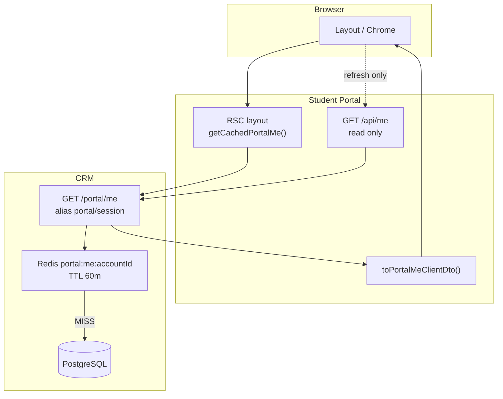

# Portal SSR Shell & Identity — Spec triển khai (v3.1)

> **Phiên bản:** 3.1  
> **Cập nhật:** 2026-07-28  
> **Trạng thái:** **READY FOR IMPLEMENTATION**  
> **CRM cache:** [PORTAL_UNIFIED_ME_CACHE_SPEC.md](../../ebest-crm-api/docs/modules/student-portal/PORTAL_UNIFIED_ME_CACHE_SPEC.md)  
> **Liên quan:** [PORTAL_BFF_AUTH_AND_IDENTITY_REUSE_SPEC](./PORTAL_BFF_AUTH_AND_IDENTITY_REUSE_SPEC.md) · [UPA](../../ebest-crm-api/docs/monorepo/portal-identity/UNIFIED_PORTAL_AUTHENTICATION_SPEC.md)

---

## 0. Quyết định đã chốt (ADR) — cập nhật v3

| ID | Quyết định | Ghi chú v3 |
|----|------------|------------|
| **SSR-ADR-1** | Session-Seed Hybrid (phased) | Giữ |
| **SSR-ADR-2** | ~~Không tạo CRM `/portal/me`~~ → **REVISED** | **Một read SSOT `GET portal/me`** (alias `portal/session`); actor-agnostic |
| **SSR-ADR-7** | Redis cache key **`portal:me:{accountId}`**, TTL **60 phút** | CRM `PortalMeCacheService` |
| **SSR-ADR-8** | Portal BFF read **một** `GET /api/me` → CRM `portal/me` | Bỏ read mount `/api/lead/me` |
| **SSR-ADR-9** | **`actor`** trong response = key layout chrome | Customer vs lead vs guest |
| **SSR-ADR-5** | `React cache()` dedupe BFF → CRM **1 call/request** | Portal L0 |
| **SSR-ADR-6** | PI-D18 — `omniLeadId` server-only trên BFF mapper | Seed client strip |
| **SSR-ADR-10** | **`accountType` đổi → invalidate** `portal:me:{accountId}` | Promote D27, attach D18 — ME-CACHE-D4 |

**Kế hoạch triển khai chi tiết:** [PORTAL_SSR_UNIFIED_ME_IMPLEMENTATION_PLAN.md](./PORTAL_SSR_UNIFIED_ME_IMPLEMENTATION_PLAN.md)  
**Impact & Next.js patterns:** [PORTAL_SSR_IMPACT_AND_NEXTJS_PATTERNS.md](./PORTAL_SSR_IMPACT_AND_NEXTJS_PATTERNS.md)

**Tóm tắt v3:** Gom read về **một `/me`** (CRM + BFF), cache Redis theo **`accountId`** (không phải `customerId`), build theo **`accountType`**, invalidate khi type/profile đổi, layout branch theo **`actor`**.

### 1.0 Mô hình Account vs Customer

| Entity | ID | Vai trò |
|--------|-----|---------|
| **PortalAccount** | `accountId` | JWT + **cache key** (`customer_credentials`) |
| **Customer** | `customerId` | Hồ sơ HV — join khi `accountType=customer` |
| **accountType** | lead \| customer | = **`actor`** quyết định layout |

`customerId ≠ accountId` — **luôn đúng** (2 bảng). Account row chứa pointer `customer_id` / `omni_lead_id` tùy type. Chi tiết flow + invalidate: [PORTAL_UNIFIED_ME_CACHE_SPEC v1.1](../../ebest-crm-api/docs/modules/student-portal/PORTAL_UNIFIED_ME_CACHE_SPEC.md).

---

## 1. Vấn đề cần giải (tái xác nhận)

```text
Login → JWT cookie
  → Root SSR: portal/session
  → Hydrate
  → customer: AuthProvider → GET /api/me          ← thừa
  → lead: LeadLayout → GET /api/lead/me          ← thừa
  → Dashboard layout → GET student/me (CRM)       ← thừa (classes)
```

**Root cause:**

1. Portal BFF **3 read path** (`portal/session`, `/api/me`, `/api/lead/me`)
2. CRM customer cache **customerId**; lead **không cache**
3. BFF mapper drop `classes` → buộc gọi lại `student/me`

---

## 2. Kiến trúc mục tiêu — Unified `/me`



### 2.1 Một endpoint, một cache key

| Tầng | Endpoint | Auth |
|------|----------|------|
| **CRM SSOT** | `GET /api/v1/student/portal/me` | `PortalJwt` |
| **CRM alias** | `GET …/portal/session` | Cùng handler — compat |
| **Portal BFF read** | `GET /api/me` | Cookie → Bearer CRM |
| **Portal SSR** | `getCachedPortalMe()` | Cookie → CRM `portal/me` |

**Cache Redis (CRM):**

```text
Key:  portal:me:{accountId}
TTL:  3600s (PORTAL_ME_CACHE_TTL_SECONDS)
Miss: branch accountType → customer build | lead build → SET → return
Hit:  return snapshot (giảm DB)
```

**Invalidation:** PATCH profile customer/lead → `DEL portal:me:{accountId}`

### 2.2 Login không bắt buộc trả full profile

| Cách | Đánh giá |
|------|----------|
| Login response embed full me | Payload login nặng; duplicate cache logic |
| Login chỉ JWT + **warm cache async** (P2) | ✅ Tùy chọn — navigation đầu HIT |
| **First GET `/me` sau login populate cache** | ✅ **Mặc định** — đơn giản, đúng TTL |

---

## 3. Ma trận dữ liệu — layout vs nội bộ

### 3.1 Trường quyết định layout (bắt buộc trong `/me`)

| Field | Customer | Lead | Client seed | SSR full |
|-------|----------|------|-------------|----------|
| **`actor`** | ✅ | ✅ | ✅ | ✅ |
| **`displayName`** | header | header | ✅ | ✅ |
| **`profileCompleted`** | — | gate chrome / complete-profile | ✅ | ✅ |
| **`classes[]`** | sidebar menu | — | ✅ | ✅ |
| **`customer` brief** | header, profile link | — | ✅ | ✅ |
| **`passwordSetupRequired`** | — | wizard | ✅ | ✅ |
| **`googleLinked`** | — | wizard UX | ✅ | ✅ |
| **`missingProfileFields`** | — | wizard | ✅ (optional) | ✅ |

### 3.2 Server-only (không xuống client — PI-D18)

| Field | Dùng cho |
|-------|----------|
| `accountId` | BFF inject MTO, offline reg |
| `omniLeadId` | MTO bootstrap, results union |
| `customerId` | CRM business routes |
| `identityUpgrade` raw | Server redirect re-login |

### 3.3 Client DTO (`PortalMeClient` — BFF mapper)

```typescript
type PortalMeClient =
  | {
      actor: 'customer';
      displayName: string;
      customer: StudentMeCustomerBrief; // strip omniLeadId
      classes: PortalShellClassItem[];
    }
  | {
      actor: 'lead';
      displayName: string;
      profile: Omit<LeadProfile, 'omniLeadId'>;
      profileComplete: boolean;
    }
  | { actor: 'guest' }; // 401 / no cookie — BFF only
```

### 3.4 Nhánh layout theo `actor`

| actor | Chrome | Redirect guard |
|-------|--------|----------------|
| `guest` | Public / marketing | Login nếu route protected |
| `customer` | `CustomerPortalChrome` / dashboard shell | Lead routes → MTO hoặc results |
| `lead` | `LeadAuthenticatedLayout` hoặc funnel minimal | Customer dashboard → lead hub; `!profileComplete` → complete-profile |

**Key:** Chỉ cần **`actor` + `profileComplete`** (lead) hoặc **`actor` + `classes`** (customer) để quyết định shell — không probe thêm API.

---

## 4. So sánh phương án (cập nhật v3)

| Tiêu chí | **★ Unified `/me` + Redis accountId** | v2 Session-seed only (không CRM) | Client `/api/portal/shell` |
|----------|----------------------------------------|-----------------------------------|----------------------------|
| Gom API read | ✅ 1 CRM + 1 BFF | ⚠️ Vẫn 3 CRM surface | ⚠️ +1 BFF |
| Lead cache | ✅ Redis 60m | ❌ DB mỗi request | ❌ |
| Key thống nhất accountId | ✅ | ❌ customerId only | — |
| Giảm N2 waterfall | ✅ + seed SSR | Một phần | ❌ |
| CRM effort | M (1 PR) | Không | Không |
| Align UPA | ✅ | Trung bình | Trung bình |

**Chọn:** **Unified `/me` + Redis `accountId` + Portal seed** — kết hợp CRM cache (giảm DB) và BFF dedupe (giảm HTTP).

---

## 5. Trade-off & chấp nhận

| Ưu | Nhược | Mitigation |
|----|-------|------------|
| 1 HTTP read logged user | Stale profile ≤60m | PATCH → invalidate |
| Lead DB load giảm mạnh | Cache memory Redis | TTL + key per account |
| Layout deterministic từ `actor` | HTML seed lớn hơn | Chỉ layout fields |
| accountId key UPA-ready | Migration key customer cũ | Dual invalidate 1 release |
| `/api/me` một path client | Breaking client gọi lead/me read | Deprecate dần; PATCH giữ path cũ |

---

## 6. Điểm mù & nghẽn (cập nhật)

| ID | Mô tả | Fix |
|----|-------|-----|
| **BL-1** | BFF drop `classes` | L1 parse từ `/me` payload |
| **BL-11** | Lead **không Redis** — mọi portal/session = DB | **CRM PortalMeCacheService** |
| **BL-12** | Cache cũ key `customerId` — **by design** khác `accountId`; lead không có customerId | Key mới **`portal:me:{accountId}`**; build theo `accountType` |
| **BL-15** | Promote lead→customer **giữ accountId** — cache còn snapshot `actor:lead` | **Invalidate on promote** + envelope meta validate |
| **BL-16** | Attach D18 xóa lead account — 2 accountId | Invalidate survivor + deleted lead |
| **BL-13** | `identityUpgrade` trong lead me — cache stale re-login | Invalidate on upgrade; hoặc bypass cache khi upgrade flag |
| **BL-14** | Lead `getMe` + cookie upgrade side-effect | Cache **snapshot sau** upgrade apply; không cache pre-upgrade |
| **N1** | N CRM calls/request | `React cache()` + 1 endpoint |
| **N2** | Client double fetch me | Single seed từ SSR `/me` |
| **N5** | MTO: session + me + attempt | Session/me merged; attempt riêng (read-only) |

---

## 7. Kế hoạch triển khai (thứ tự PR)

> **Chi tiết đầy đủ (SSR vs client contract, checklist file, test matrix):**  
> [PORTAL_SSR_UNIFIED_ME_IMPLEMENTATION_PLAN.md](./PORTAL_SSR_UNIFIED_ME_IMPLEMENTATION_PLAN.md)

### Wave A — CRM

| PR | Việc |
|----|------|
| **CRM-1** | `PortalMeCacheService` — key `portal:me:{accountId}`, TTL 3600 |
| **CRM-2** | `GET portal/me` alias; `PortalSessionReadService` delegate cache |
| **CRM-3** | Invalidate on PATCH customer + lead; dual-invalidate legacy customer key |

### Wave B — Portal BFF + SSR

| PR | Việc |
|----|------|
| **PR-1** | `getCachedPortalMe()` — React cache, upstream `portal/me` |
| **PR-2** | `toPortalMeClientDto()`; root layout seed; parse `classes` |
| **PR-3** | `GET /api/me` proxy `portal/me` actor-agnostic; mapper actor branch |
| **PR-4** | `AuthProvider` + `LeadAuthenticatedLayoutClient` — seed only, skip fetch |
| **PR-5** | Deprecate read: dashboard `fetchStudentMeForSsr`, client mount `fetchLeadProfile` |
| **PR-6** | RSC chrome L3 (optional) |

### 7.1 Tiêu chí Done

| Check | Expected |
|-------|----------|
| CRM lead GET `/portal/me` ×2 | 1× DB, 1× Redis HIT |
| CRM customer | Cache theo accountId |
| Portal cold load HV | 1× CRM; 0× `/api/me` client |
| Portal cold load lead | 1× CRM; 0× `/api/lead/me` client |
| PATCH profile | Next GET fresh |
| Layout | Branch `actor` only — no spinner waiting second API |

### 7.2 Checklist PR Portal

- [ ] `getCachedPortalMe` dùng mọi RSC; Route Handler `/api/me` không React cache
- [ ] `toPortalMeClientDto` test — no `omniLeadId` leak
- [ ] Constants: `STUDENT_API.portalMe = 'portal/me'`
- [ ] Regression MTO, complete-profile, logout

---

## 8. Code map

### CRM

| File | Vai trò |
|------|---------|
| `portal-me-cache.service.ts` | **Mới** — Redis SSOT |
| `portal-session-read.service.ts` | Delegate cache |
| `student-portal-unified.controller.ts` | `GET portal/me` |
| `student-portal-me-cache.service.ts` | `buildFresh(customerId)` internal |

### Portal

| File | Vai trò |
|------|---------|
| `portal-me-cache.server.ts` | **Mới** — `getCachedPortalMe` |
| `portal-me-client.util.ts` | **Mới** — `toPortalMeClientDto` |
| `resolve-portal-session.server.ts` | Refactor → gọi portal/me + map đầy đủ classes |
| `app/layout.tsx` | Seed `PortalMeClient` |
| `app/api/me/route.ts` | Proxy portal/me (read); PATCH giữ student/me |
| `contexts/auth-context.tsx` | Single me seed |
| `lib/lead-portal/client-api.ts` | `fetchLeadProfile` — chỉ refresh manual |

---

## 9. Env

```env
# CRM
PORTAL_ME_CACHE_TTL_SECONDS=3600

# Portal (optional — BFF in-memory dedupe, không thay Redis CRM)
# PORTAL_BFF_ME_INFLIGHT_TTL_MS=15000  — có thể bỏ sau unified me
```

---

## 10. Liên kết tracker

| Tracker | ID |
|---------|-----|
| [LEAD_PORTAL_WORK_TRACKER](./LEAD_PORTAL_WORK_TRACKER.md) | CRM-1…3, PR-1…6 |
| [PORTAL_SSR_UNIFIED_ME_IMPLEMENTATION_PLAN](./PORTAL_SSR_UNIFIED_ME_IMPLEMENTATION_PLAN.md) | **Execution plan Wave A–C** |
| [PORTAL_BFF §8–9](./PORTAL_BFF_AUTH_AND_IDENTITY_REUSE_SPEC.md) | BFF-ID-5, A6–A9 |

---

**Chốt v3:** **`GET portal/me`** (CRM) + **`GET /api/me`** (BFF read) + Redis **`portal:me:{accountId}`** TTL **60p** + SSR seed theo **`actor`**. Eliminate N2 waterfall; layout key = account type từ một response.
