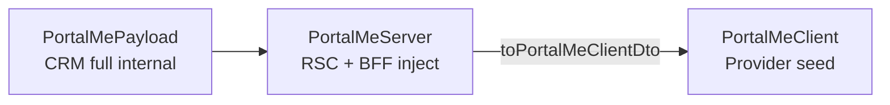

# Portal SSR + Unified `/me` — Kế hoạch triển khai đầy đủ

> **Phiên bản:** 1.0  
> **Cập nhật:** 2026-07-28  
> **Trạng thái:** **EXECUTION PLAN** — sẵn sàng bắt đầu Wave A  
> **Spec:** [PORTAL_SSR_SHELL_AND_IDENTITY_SPEC.md](./PORTAL_SSR_SHELL_AND_IDENTITY_SPEC.md) v3.1  
> **CRM cache:** [PORTAL_UNIFIED_ME_CACHE_SPEC.md](../../ebest-crm-api/docs/modules/student-portal/PORTAL_UNIFIED_ME_CACHE_SPEC.md) v1.1  
> **BFF:** [PORTAL_BFF_AUTH_AND_IDENTITY_REUSE_SPEC.md](./PORTAL_BFF_AUTH_AND_IDENTITY_REUSE_SPEC.md) §8–9  
> **Impact / Next.js:** [PORTAL_SSR_IMPACT_AND_NEXTJS_PATTERNS.md](./PORTAL_SSR_IMPACT_AND_NEXTJS_PATTERNS.md)

---

## 1. Tóm tắt mục tiêu

| Mục tiêu | Cách đạt |
|----------|----------|
| **Một read API** | CRM `GET portal/me` + Portal BFF `GET /api/me` |
| **Giảm DB/HTTP** | Redis `portal:me:{accountId}` TTL 60p + `React cache()` 1 call/request |
| **Layout từ `actor`** | SSR seed → Provider; không fetch me/lead/me on mount |
| **SSR vs client rõ ràng** | Server: full payload + guards; Client: `PortalMeClient` seed + AJAX partial |
| **accountType đổi** | Invalidate cache (promote, attach, PATCH) |

---

## 2. Quyết định đã khóa (reference)

| ID | Nội dung |
|----|----------|
| SSR-ADR-1…10 | Session-Seed Hybrid + unified `/me` + accountId cache + invalidate on type change |
| ME-CACHE-D1…D5 | CRM envelope, meta validate, invalidate hooks |
| BFF-ID-5, A6–A9 | BFF read một path; PI-D18 strip omni |

---

## 3. Phân tầng dữ liệu — SSR vs Client

### 3.1 Ba lớp payload



| Lớp | Type (Portal) | Chứa omni/accountId? | Ai dùng |
|-----|---------------|----------------------|---------|
| **CRM internal** | `PortalMePayload` | ✅ | CRM, BFF upstream parse |
| **Server-only** | `PortalMeServer` | ✅ | RSC guards, MTO `resolve-mto-caller-identity`, mint HMAC |
| **Client seed** | `PortalMeClient` | ❌ (PI-D18) | `PortalSessionProvider`, `AuthProvider`, layout chrome |

### 3.2 Contract `PortalMeClient` (serialize RSC → client)

**File mới:** `src/lib/portal-auth/portal-me-client.types.ts`

```typescript
export type PortalShellClassItem = {
  id: number;
  name: string;
  status?: string | null;
};

export type LeadProfileClientSeed = {
  id: number;
  displayName: string | null;
  email: string;
  phoneE164: string | null;
  emailVerifiedAt: string | null;
  profileCompleted: boolean;
  profileCompletedAt?: string | null;
  passwordSetupRequired?: boolean;
  googleLinked?: boolean;
  missingProfileFields?: string[];
  // KHÔNG omniLeadId, KHÔNG identityUpgrade
};

export type PortalMeClient =
  | { actor: 'guest' }
  | {
      actor: 'customer';
      displayName: string;
      customer: StudentMeCustomerBrief; // parseStudentMeCustomerBrief + strip omni
      classes: PortalShellClassItem[];
    }
  | {
      actor: 'lead';
      displayName: string;
      profile: LeadProfileClientSeed;
      profileComplete: boolean;
    };
```

### 3.3 Contract `PortalMeServer` (server-only, không serialize client)

**File mới:** `src/lib/portal-auth/portal-me-server.types.ts`

```typescript
export type PortalMeServer =
  | { actor: 'guest' }
  | {
      actor: 'customer';
      accountId: string;
      customerId: number;
      omniLeadId: string | null;
      displayName: string;
      customer: StudentMeCustomerBrief;
      classes: PortalShellClassItem[];
    }
  | {
      actor: 'lead';
      accountId: string;
      omniLeadId: string;
      displayName: string;
      profile: LeadProfile; // full incl. omni — server only
      profileComplete: boolean;
    };
```

**Mapper:** `toPortalMeServer(crmPayload)` · `toPortalMeClient(server: PortalMeServer): PortalMeClient`

### 3.4 Ma trận field — ai cần gì

| Field | SSR layout/guard | Client render | Client logic sau | AJAX refresh |
|-------|-------------------|---------------|------------------|----------------|
| `actor` | ✅ branch chrome, redirect | ✅ Provider | ✅ route guard client | `/api/me` |
| `displayName` | ✅ SSR header (L3) | ✅ shell | — | PATCH profile |
| `classes[]` | ✅ menu SSR props | ✅ dashboard menu | — | `router.refresh()` |
| `customer` brief | — | ✅ avatar, name | `fetchWithAuth` scope | PATCH `/api/me` |
| `profileComplete` | ✅ redirect complete-profile | ✅ lead gate | wizard | complete-profile POST |
| `profile` (lead) | ✅ server redirect | ✅ shell, wizard | incomplete paths | `/api/lead/me` PATCH |
| `omniLeadId` | ✅ MTO bootstrap only | ❌ | ❌ | — |
| `accountId` | ✅ BFF inject | ❌ | ❌ | — |

### 3.5 Client logic **sau hydrate** — vẫn AJAX (không SSR lại shell)

| Use case | API | Ghi chú |
|----------|-----|---------|
| Sửa profile HV | `PATCH /api/me` | Invalidate CRM cache → `router.refresh()` |
| Sửa profile lead | `PATCH /api/lead/me` | Giữ path mutation tạm |
| Upload avatar | `POST /api/me/avatar` | Refresh auth context |
| Danh sách kết quả MTO | `GET /api/me/mock-test-results` hoặc lead variant | Partial list |
| Exam runtime / quiz | GW BFF | Không liên quan `/me` |
| Logout | `POST /api/portal/logout` | Clear providers |
| Manual refresh session | `GET /api/me` | Sau login client-side hoặc stale UX |

---

## 4. Kiến trúc Provider (sau triển khai)

```text
app/layout.tsx (RSC)
  getCachedPortalMe() → PortalMeServer
  seedClient = toPortalMeClient(server)
  │
  ├─ PortalMeProvider initialMe={seedClient}     ← NEW (hoặc mở rộng PortalSessionProvider)
  ├─ AuthProvider initialCustomer + seedComplete  ← customer branch từ seed
  └─ children

PortalChromeGate / layouts
  usePortalMe() → actor, displayName, classes, profile
  skip fetch on mount nếu seed.actor !== 'guest'
```

**Deprecate dần:** `PortalSessionProvider` minimal `{actor, displayName}` → merge vào `PortalMeProvider` hoặc giữ thin wrapper đọc từ `PortalMeProvider`.

---

## 5. Lộ trình triển khai — 3 wave

### Tổng quan

| Wave | Phạm vi | PR | Deploy | Phụ thuộc |
|------|--------|-----|--------|-----------|
| **A** | CRM cache + `portal/me` | CRM-1…3 | CRM trước hoặc cùng Portal PR-1 | Redis prod |
| **B** | Portal SSR seed + BFF | PR-1…5 | Portal sau CRM-2 | Wave A live |
| **C** | RSC chrome + route groups | PR-6…7 | Optional | Wave B stable |

---

### Wave A — CRM (`ebest-crm-api`)

#### CRM-1 — `PortalMeCacheService` (P0)

| Task | Chi tiết |
|------|----------|
| Tạo `portal-me-cache.service.ts` | Key `portal:me:{accountId}`, TTL env 3600 |
| Envelope | `{ meta: { accountId, accountType, authVersion }, payload }` |
| HIT validate | meta.accountType + authVersion vs DB |
| Build lead | `leadAuth.buildMeSnapshot(accountId)` |
| Build customer | `studentPortalMeCache.buildFresh(customerId)` + account meta |
| Unit test | HIT/MISS, meta mismatch → rebuild |

**Files:**

- `src/student-portal/portal-me-cache.service.ts` **NEW**
- `src/student-portal/portal-me-cache.service.spec.ts` **NEW**
- `src/student-portal/student-portal.module.ts` — register provider

**Done:** 2× GET `/portal/me` cùng account → 1 DB round-trip (lead + customer).

#### CRM-2 — Route alias + delegate (P0)

| Task | Chi tiết |
|------|----------|
| `STUDENT_ROUTES.portalMe = 'portal/me'` | constants.ts |
| `GET portal/me` | `StudentPortalUnifiedController` — same handler as session |
| Refactor | `PortalSessionReadService` → delegate `PortalMeCacheService.getByPortalUser(user)` |

**Files:**

- `constants.ts`, `student-portal-unified.controller.ts`
- `portal-session-read.service.ts` — thin delegate

**Done:** Swagger + README ghi `portal/me` canonical.

#### CRM-3 — Invalidate hooks (P0)

| Task | Gọi từ |
|------|--------|
| `invalidateByAccountId(id)` | PATCH student/me, PATCH lead/me, complete-profile |
| Promote D27 | `promoteLeadToCustomer` sau DB update |
| Attach D18 | survivor + deleted lead accountId |
| Legacy dual | `student_portal:me:{customerId}` DEL (1 release) |

**Files:**

- `portal-authentication.service.ts`
- `student-portal-me.controller.ts`
- `student-portal-lead-auth.service.ts`

**Done:** Test promote → cache lead cleared → GET returns customer actor.

---

### Wave B — Portal (`ebest-student-portal`)

#### PR-1 — Server fetch dedupe (P0)

| Task | Chi tiết |
|------|----------|
| `STUDENT_API.portalMe` | `lib/student-api.ts` |
| `fetchPortalMeFromCookies()` | Gọi CRM `portal/me`, map `PortalMeServer` |
| `getCachedPortalMe = cache(fetchPortalMeFromCookies)` | `portal-me-cache.server.ts` |
| Thay import RSC | `resolvePortalSessionFromCookies` → `getCachedPortalMe` (giữ alias deprecated) |

**Files thay import (RSC only):**

- `app/layout.tsx`
- `app/(dashboard)/layout.tsx` — chuẩn bị PR-2
- `features/portal-mock-test/server/*.server.ts`
- `app/mock-test-online/**/page.tsx`
- **Không** cache Route Handlers

**Done:** Log/metrics — 1 upstream CRM call per page navigation.

#### PR-2 — Types + mappers + root seed (P0)

| Task | Chi tiết |
|------|----------|
| `portal-me-client.types.ts` | Contract §3.2 |
| `portal-me-server.types.ts` | Contract §3.3 |
| `portal-me-mapper.ts` | `toPortalMeServer`, `toPortalMeClient`, parse classes |
| `app/layout.tsx` | `getCachedPortalMe()` → seed providers |
| `(dashboard)/layout.tsx` | `classes` từ server me — **xóa** `fetchStudentMeForSsr` |

**Provider wiring:**

```tsx
const me = await getCachedPortalMe();
const clientMe = toPortalMeClient(me);
// PortalSessionProvider: initialMe={clientMe}
// AuthProvider: initialCustomer + seedComplete={clientMe.actor==='customer'}
```

**Done:** Dashboard menu có classes; không CRM `student/me` từ dashboard layout.

#### PR-3 — BFF `GET /api/me` unified read (P1)

| Task | Chi tiết |
|------|----------|
| `GET /api/me/route.ts` | Proxy CRM `portal/me` (not `student/me`) |
| Response | `PortalMeClient` shape (strip server fields) |
| `GET /api/portal/session` | Giữ `{ actor, displayName }` minimal refresh — hoặc alias client me pick fields |

**Done:** Postman/curl logged lead + customer → một response shape phân nhánh `actor`.

#### PR-4 — Skip client mount fetch (P1)

| Task | File |
|------|------|
| `AuthProvider` — skip `refreshSession` khi seed customer | `auth-context.tsx` |
| `LeadAuthenticatedLayoutClient` — `initialProfile` + `skipInitialProbe` | wire từ layout/`PortalChromeGate` |
| `CustomerPortalChromeClient` — `initialClasses` prop | fix `classes: []` |
| `DashboardLayoutClient` — bỏ redundant refresh gate | `(dashboard)/DashboardLayoutClient.tsx` |

**Done:** Network tab — cold load logged user **0** `GET /api/me` trước tương tác.

#### PR-5 — Cleanup duplicate SSR helpers (P2)

| Task | File |
|------|------|
| Replace `fetchStudentMeForSsr` | `fetch-online.server.ts`, `fetch-public-mock-test.server.ts`, `mock-test/offline/page.tsx` |
| Deprecate comment | `lib/server/student-me.ts` |
| `resolve-portal-session.server.ts` | Re-export `getCachedPortalMe` hoặc merge |

**Done:** Grep `fetchStudentMeForSsr` — 0 production imports (trừ deprecated file).

#### PR-6 — RSC chrome (P3, optional)

| Task | Chi tiết |
|------|----------|
| Route group `(portal-app)` | Layout RSC branch `actor` |
| `PortalChrome` server component | Menu + header SSR; client islands logout/collapse |
| Deprecate spinner | `PortalChromeGate` fallback only |

---

### Wave C — Hardening (post Wave B)

| ID | Việc |
|----|------|
| C-1 | Vitest `toPortalMeClient` — no omni leak |
| C-2 | E2E smoke: login HV → dashboard; login lead → MTO |
| C-3 | Staging load test — CRM `/portal/me` HIT ratio |
| C-4 | Remove legacy `student_portal:me:{customerId}` read path |
| C-5 | `PortalMeProvider` thay merge session context |

---

## 6. Thứ tự deploy production

```text
1. Deploy CRM-1 + CRM-2 (+ CRM-3 invalidate)  → verify Redis HIT staging
2. Deploy Portal PR-1 + PR-2                   → verify 1 CRM call, seed classes
3. Deploy Portal PR-3 + PR-4                   → verify no client mount fetch
4. Deploy Portal PR-5                          → cleanup
5. (Optional) PR-6                             → RSC chrome
```

**Rollback:** Portal có thể rollback độc lập — CRM `portal/session` alias vẫn hoạt động.

---

## 7. Ma trận kiểm thử

| # | Scenario | Actor | Assert |
|---|----------|-------|--------|
| T1 | Cold `/` | customer | 1× CRM portal/me; menu classes; no client /api/me |
| T2 | Cold `/mock-test-online` | lead | 1× CRM; no /api/lead/me mount |
| T3 | Guest marketing | guest | 0× CRM me (no cookie) |
| T4 | PATCH profile HV | customer | Next navigation fresh name |
| T5 | Promote lead→customer | — | Cache invalidate; actor customer after re-login |
| T6 | MTO select-exam SSR | both | `getCachedPortalMe` dedupe with root |
| T7 | Logout | — | Providers guest; no stale seed |
| T8 | PI-D18 | — | Client JSON no omniLeadId/accountId |

---

## 8. Checklist file — Portal (copy PR)

### PR-1

- [ ] `src/lib/student-api.ts` — `portalMe`
- [ ] `src/lib/portal-auth/portal-me-cache.server.ts` **NEW**
- [ ] `src/lib/portal-auth/fetch-portal-me.server.ts` **NEW**
- [ ] Replace RSC imports (list § PR-1)

### PR-2

- [ ] `portal-me-client.types.ts` **NEW**
- [ ] `portal-me-server.types.ts` **NEW**
- [ ] `portal-me-mapper.ts` **NEW**
- [ ] `portal-me-mapper.test.ts` **NEW**
- [ ] `app/layout.tsx`
- [ ] `app/(dashboard)/layout.tsx`
- [ ] `contexts/portal-me-context.tsx` **NEW** (optional) hoặc extend session

### PR-4

- [ ] `contexts/auth-context.tsx`
- [ ] `components/portal/PortalChromeGate.tsx`
- [ ] `components/portal/CustomerPortalChromeClient.tsx`
- [ ] `components/lead-portal/LeadAuthenticatedLayoutClient.tsx`

---

## 9. Env & ops

```env
# CRM (ebest-crm-api)
PORTAL_ME_CACHE_TTL_SECONDS=3600

# Portal — không bắt buộc thêm env Wave B
# CRM_API_URL đã có
```

**Monitoring (staging):**

- Log `portal.ssr.me` duration + cache hit (CRM internal metric P2)
- Count `GET /api/me` from browser per session — target → 0 on first paint

---

## 10. Tracker cross-ref

Cập nhật tiến độ tại [LEAD_PORTAL_WORK_TRACKER.md](./LEAD_PORTAL_WORK_TRACKER.md) § SSR implementation.

| ID | Wave | Status |
|----|------|--------|
| CRM-1…3 | A | ⬜ |
| PR-1…5 | B | ⬜ |
| PR-6 | C | ⬜ |
| C-1…5 | Hardening | ⬜ |

---

## 11. Out of scope (wave này)

- UPA unified login UI (tab bỏ mode) — SSR-ADR L5 riêng
- Xóa CRM `GET student/me` / `lead/me` — sau C-4
- Warm cache on login — P2 CRM
- Full RSC header HTML — PR-6

---

**Bước tiếp theo đề xuất:** Bắt **CRM-1** + **PR-1** song song; merge CRM trước PR-2 staging.

**File-level impact:** [PORTAL_SSR_IMPACT_AND_NEXTJS_PATTERNS.md](./PORTAL_SSR_IMPACT_AND_NEXTJS_PATTERNS.md) §3–7.
