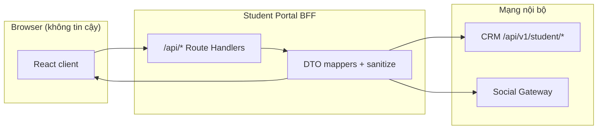

# Student Portal — BFF response security (SSOT)

> **Phiên bản:** 1.1  
> **Cập nhật:** 2026-07-06  
> **Trạng thái:** **PLANNED** — rà soát + chuẩn hóa dần  
> **Phạm vi:** Next.js Route Handlers `/api/*` · proxy CRM / Gateway · response tới browser

**Nguyên tắc cốt lõi (SP-SEC):**

| ID | Quy tắc |
|----|---------|
| **SP-SEC-1** | Browser **chỉ** nhận DTO đã map — không passthrough JSON CRM/Gateway. |
| **SP-SEC-2** | Lỗi hiển thị: **`{ message, code? }`** — không stack, không `errors` object thô, không metadata nội bộ. |
| **SP-SEC-3** | Message **không** tiết lộ kiến trúc: lead/customer/omni/credential/Gateway/CRM/module name. |
| **SP-SEC-4** | Conflict email/SĐT: client chỉ biết **«đã có trong hệ thống»** — **không** phân biệt actor nội bộ. |
| **SP-SEC-5** | Chi tiết kỹ thuật + phân loại nội bộ → **server log** / CRM response nội bộ; BFF map trước khi trả client. |
| **SP-SEC-6** | Một helper SSOT: `sanitizeApiErrorPayload` + **`mapPortalConflictForClient`** (mới). |

**Liên quan:**

| Chủ đề | File |
|--------|------|
| Sanitize message (as-built) | `ebest-student-portal/src/lib/student-safe-errors.ts` |
| Proxy CRM | `crm-student-proxy.ts`, `student-crm-proxy.ts` |
| Email trùng (logic nội bộ) | [PORTAL_LOGIN_KEY_EMAIL_CONFLICT_SPEC.md](../../ebest-crm-api/docs/system/PORTAL_LOGIN_KEY_EMAIL_CONFLICT_SPEC.md) |
| Master plan | [PORTAL_LOGIN_KEY_AND_BFF_MASTER_PLAN.md](../../ebest-crm-api/docs/monorepo/portal-identity/PORTAL_LOGIN_KEY_AND_BFF_MASTER_PLAN.md) |
| UX không lộ thuật ngữ | [LEAD_PORTAL_SESSION_AND_MARKETING_SPEC.md](./LEAD_PORTAL_SESSION_AND_MARKETING_SPEC.md) UX-1 |

---

## 1. Ranh giới tin cậy



- **CRM** có thể trả `conflict.type = customer_portal | lead_portal` — **chỉ dùng server-side**.
- **Client** nhận tối đa:

```typescript
/** Lỗi chuẩn — duy nhất shape lỗi public */
interface StudentPortalClientError {
  message: string;
  code?: 'EMAIL_ALREADY_IN_SYSTEM' | 'DUPLICATE_EMAIL' | string; // whitelist
  action?: 'login' | 'use_other_email' | 'contact_support';
}
```

**Không** trả: `conflict`, `customerId`, `leadAccountId`, `omniLeadId`, `suggestedAction: login_customer`, `actor` trong **lỗi conflict**.

---

## 2. Email trùng — mapping BFF (PI-D16)

### 2.1 CRM (nội bộ)

Resolver trả đủ metadata phục vụ log và quyết định server:

```typescript
// CRM only — không serialize ra client
{ type: 'customer_portal' | 'lead_portal' | 'customer_profile' | ... }
```

### 2.2 Client (sau BFF)

| CRM `conflict.type` (nội bộ) | `code` client | `action` client | `message` (một câu) |
|------------------------------|---------------|-----------------|---------------------|
| `customer_portal` | `EMAIL_ALREADY_IN_SYSTEM` | `login` | Email này đã được đăng ký trong hệ thống Ebest. Nếu đúng email của bạn, hãy **đăng nhập**. Nếu không, dùng email khác. |
| `lead_portal` | `EMAIL_ALREADY_IN_SYSTEM` | `login` | *(cùng message — không nói «thi thử» / «lead»)* |
| `customer_profile` | `EMAIL_ALREADY_IN_SYSTEM` | `contact_support` | Email này đã được sử dụng. Vui lòng liên hệ Fanpage Ebest hoặc dùng email khác. |
| `same_lead` / `same_customer` | `EMAIL_ALREADY_IN_SYSTEM` | `login` | Tài khoản đã tồn tại. Vui lòng đăng nhập. |

**Complete-profile:** `/api/profile` BFF gọi `mapPortalConflictForClient(crmBody)` — **không** forward `code: DUPLICATE_EMAIL` thô nếu kèm metadata nội bộ.

**Login mode (LP-D1):** User **tự chọn** «HV / Chưa học» trên UI — đó là UX, **không** suy từ error payload. Nút «Đăng nhập» link `/login` **không** bắt buộc `?mode=lead` từ conflict (tránh lộ phân nhánh).

---

## 3. Pattern BFF bắt buộc

### 3.1 Lỗi — luôn qua sanitize

```typescript
// ✅ SSOT
return NextResponse.json(
  sanitizeApiErrorPayload(crmData, res.status, fallback),
  { status: res.status },
);

// ✅ Conflict email — thêm map
return NextResponse.json(
  mapPortalConflictForClient(crmData, res.status),
  { status: 409 },
);
```

```typescript
// ❌ Cấm — lộ CRM body
return NextResponse.json(data, { status: res.status });
```

### 3.2 Thành công — whitelist field

Mỗi route có **mapper** (vd. `parseStudentMeCustomerBrief`, `mapLeadProfile`). Không `unwrapCrmResponseBody` → trả thẳng client nếu chưa map.

### 3.3 Message CRM — lọc thuật ngữ nội bộ

Bổ sung pattern vào `student-safe-errors.ts` (kế hoạch):

| Pattern (regex / substring) | Thay bằng |
|-----------------------------|-----------|
| `lead`, `customer`, `omni`, `credential`, `portal account` | message generic |
| `cổng học viên` vs `tài khoản lead` trong **lỗi auth** | «Email/SĐT hoặc mật khẩu không đúng» |
| `@mto.ebest.internal` | không bao giờ ra client |
| Mongo ObjectId, `customerId`, `registrationId` trong message | generic |

---

## 4. Rà soát Route Handlers (2026-07-06)

**Chú thích:** ✅ an toàn / 🟡 một phần / 🔴 cần sửa

### 4.1 Auth & profile

| Route | Sanitize lỗi | Map success | Rủi ro |
|-------|--------------|-------------|--------|
| `POST /api/auth/login` | 🟡 message only | 🟡 trả `actor`, `customer` | `actor` expose kiến trúc — **chấp nhận** cho login; ẩn trong conflict |
| `POST /api/auth/lead/login` | 🟡 | 🟡 `actor: lead`, `account` | Tách endpoint `/lead/*` lộ dual auth — **known**; không nhân rộng |
| `POST /api/auth/lead/register` | ✅ `proxyStudentPostJson` | ✅ payload gọn | CRM message «Tài khoản lead» → **cần** sanitize pattern |
| `POST /api/profile` (complete-profile) | ✅ `mapPortalConflictForClient` + sanitize | ✅ whitelist success | **P0** — done M7-3 |
| `GET/PATCH /api/me` | ✅ sanitize + profile DTO | ✅ whitelist | **P0** — done M7-4 |
| `GET/PATCH /api/lead/me` | ✅ sanitize lỗi | ✅ public DTO (bỏ `omniLeadId`) | **P1** — done M7-7 |
| `GET /api/portal/session` | ✅ | ✅ `{ actor, displayName }` only | **PI-D18** — bỏ omniLeadId client |

### 4.2 Mock test online (public BFF)

| Route | Sanitize | Rủi ro |
|-------|----------|--------|
| `POST .../intake` | ✅ lỗi | 🟡 success: `pendingLeadId` — OK (opaque id) |
| `POST .../select-exam` | 🔴 lỗi raw | Gateway message có thể lộ stack |
| `POST .../provision-lead-session` | 🟡 | Tên route + response fields |
| `GET .../attempt-status` | 🟡 | Inject `omniLeadId` server-side — OK |
| Quiz runtime proxy | ✅ `student-safe-errors` | As-built tốt |

### 4.3 Learning / assignments / invoices

| Route | Pattern | Rủi ro |
|-------|---------|--------|
| `/api/student/learning/*` | ✅ `student-crm-proxy` + sanitize | Mẫu **chuẩn** |
| `/api/assignments/*` | 🟡 một số unwrap thô | **P2** audit field |
| `/api/invoices/*` | 🟡 | **P2** |

### 4.4 Proxy helpers

| Module | Lỗi OK | Ghi chú |
|--------|--------|---------|
| `proxyStudentPostJson` | ✅ message sanitized | Mẫu chuẩn POST public |
| `proxyStudentCrmGet/Request` | ✅ | Mẫu chuẩn authenticated |
| `proxyLeadAuthenticatedGetJson` | ✅ `mapPortalConflictForClient` + sanitize | **P0 fix** — done M7-2 |

---

## 5. Dữ liệu được phép lộ (allowlist)

| Ngữ cảnh | Field client | Lý do |
|----------|--------------|-------|
| Login thành công (sau user chọn mode) | `actor: customer \| lead` | LP-D1 — user đã khai báo |
| Session chrome | `actor`, `displayName` only (client) | Layout; **`omniLeadId` SSR-only** — PI-D18 / BL-Q9 |
| Complete-profile success | whitelist profile fields | Không `loginKeyType` raw từ CRM nếu không cần |
| Mock test funnel | `registrationId`, `pendingLeadId` | Opaque ids — OK |
| Lỗi validation form | `message` tiếng Việt nghiệp vụ | Sau sanitize |

| **Cấm** ra client (error hoặc success) | |
|----------------------------------------|---|
| `omniLeadId` trong error | |
| `customerId`, `leadAccountId`, `lead_portal_account_id` | |
| `conflict.type`, `suggestedAction: login_customer` | |
| Tên service: CRM, Gateway, NestJS, Redis | |
| Email placeholder `@mto.ebest.internal` | |
| Stack / `errors` validation object | |

---

## 6. Kế hoạch triển khai (gắn M6 / M7)

### M7 — BFF security hardening

| ID | Việc | Ưu tiên |
|----|------|---------|
| M7-1 | `mapPortalConflictForClient()` + unit tests | **P0** |
| M7-2 | Fix `proxyLeadAuthenticatedGetJson` error passthrough | **P0** |
| M7-3 | `/api/profile` — sanitize + conflict map | **P0** (gắn M6 complete-profile) |
| M7-4 | `/api/me` GET/PATCH — `sanitizeApiErrorPayload` + profile DTO | **P0** |
| M7-5 | Mở rộng `TECHNICAL_MESSAGE_PATTERNS` (lead/customer/omni/…) | **P0** |
| M7-6 | CRM messages audit — sửa copy server nói «lead»/«HV» trong exception user-facing | **P1** |
| M7-7 | `/api/lead/me` — public profile DTO (bỏ `identityUpgrade` raw) | **P1** |
| M7-8 | Mock test `select-exam` + routes 🔴 — sanitize lỗi | **P1** |
| M7-9 | SP-SEC AC regression | **P0** |
| M7-10 | **PI-D18** — session DTO bỏ `omniLeadId`; `usePortalSession` shrink | **P0** (BL-Q9) |
| M7-11 | Audit client dùng `omniLeadId` → SSR/BFF only | **P1** |

**Thứ tự:** M7-1 → M7-3 (M6 email) → M7-10 (session) → M7-2 → M7-4.

---

## 7. Acceptance criteria (SP-SEC)

| AC | Kiểm tra |
|----|----------|
| SP-AC-1 | Complete-profile 409: response **không** chứa `lead`, `customer`, `omni`, `conflict` |
| SP-AC-2 | Cùng message cho email trùng HV vs lead (client diff = 0) |
| SP-AC-3 | Mọi `/api/*` lỗi: body ⊆ `{ message, code?, action? }` |
| SP-AC-4 | CRM 500 với stack → client «Hệ thống tạm thời chưa sẵn sàng» |
| SP-AC-5 | `grep` response sample — không `@mto.ebest.internal`, không `ebest-crm-api` |
| SP-AC-6 | `/api/lead/me` lỗi 401 — không leak CRM wrapper `{ success: false, ... }` |

---

## 8. Quyết định

| ID | Quyết định |
|----|------------|
| **PI-D16** | Client **không** nhận phân loại conflict lead/customer; BFF map về `EMAIL_ALREADY_IN_SYSTEM` + `action` generic. |
| **PI-D17** | Mọi route BFF mới **bắt buộc** sanitize — không passthrough. |
| **PI-D18** | `omniLeadId` **SSR-only** — `/api/portal/session` client chỉ `{ actor, displayName }` (BL-Q9). |

---

*Changelog:*

| Phiên bản | Ngày | Nội dung |
|-----------|------|----------|
| 1.0 | 2026-07-06 | Khởi tạo — rà soát routes, PI-D16/D17, gắn M7 |
| 1.1 | 2026-07-06 | PI-D18 — omniLeadId SSR-only; M7-10/M7-11 (BL-Q9) |
